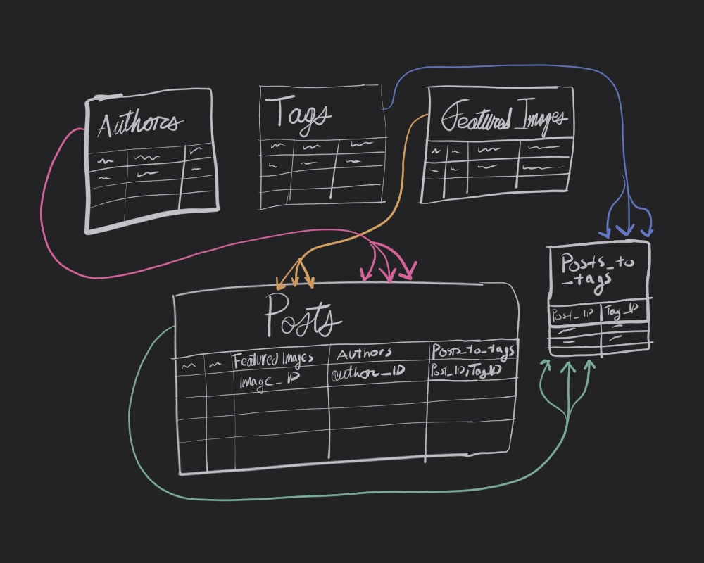

import YTEmbed from '../../../../src/components/responsive-yt-embed.tsx';

_A previous version of this article thought this would be a series of posts. I've since decided that it would be better to continue the long format after all. So, enjoy this updated article, now fully complete._

This wasn't the post I planned to write. Initially, I thought this post was going to be dedicated exclusively to my bespoke content management system. Where, I thought I’d wax poetic for a while about how _sometimes the best solutions, are tailor made._ However, I’ve since come back to my senses to realize that **_the best solution is the one with the smallest number of compromises_**, hand crafted be damned.

So, that’s where `contentlayer2`[^1] (maintained fork of `contentlayer`) came in to the equation. it's a library I stumbled upon that did exactly what I’d come up with, but in a better, more robust, and much more practical manner. In short, it's _beautiful_.

In honesty, I was awestruck by contentlayer’s pitch video[^2]. Especially so, because I’d just gone through the whole process of pouring blood, sweat, and tears into my own content management system for this site. It really wasn't long after that, that I swapped my whole custom solution out for it.

But, swallowed pride aside, creating my own content backend was quite a learning experience for me, so I wanted to talk about it. As such, I present to you my technical summary on my custom solution.

### Contents

- [Introduction](#introduction)
- [Setup](#setup)
  - [Drizzle + Turso](#drizzle--turso)
  - [Schemas](#schemas)
  - [Database Config](#database-config)
- [Overview of my CMS](#overview-of-my-cms)
  - [Scanning](#scanning)
  - [Processing](#processing)
  - [Storing Data](#storing-data)
  - [Fetching Data](#fetching-data)
  - [Rendering Data](#rendering-data)
- [Scanning the Posts](#scanning-the-posts)
  - [The Big Script: `fetch-mdx.ts`](#the-big-script-fetch-mdxts)
  - [The Main Function: `batchFetchMain()`](#the-main-function-batchfetchmain)
  - [Fetching file paths: `batchFetchMDXPaths()`](#fetching-file-paths-batchfetchmdxpaths)
- [Post Processing & Content Data Generation](#post-processing--content-data-generation)
  - [Batch processing of front matter: `batchFetchFrontMatter()`](#batch-processing-of-front-matter-batchfetchfrontmatter)
  - [Zooming in: Processing with `matterProcessor()`](#zooming-in-processing-with-matterprocessor)
    - [Assigning UUIDs & Slugs](#assigning-uuids--slugs)
      - [No ID or Slug => `comboInject()`](#no-id-or-slug--comboinject)
      - [No ID? =>`injectUUID()`](#no-id-injectuuid)
      - [No Slug? => `injectSlug()`](#no-slug--injectslug)
      - [Slug !== filename? =>`updateSlug()`](#slug--filename-updateslug)
    - [Generating Image Data](#generating-image-data)
      - [`comboImageProcessing()`](#comboimageprocessing)
      - [`imgMetaPlusBlurryPlaiceHolders()`](#imgmetaplusblurryplaiceholders)
      - [`newImageEmbedPath()`](#newimageembedpath)
  - [Zooming out](#zooming-out)
- [Inserting Content Data into the DB](#inserting-content-data-into-the-db)
  - [`bun-db-funcs.ts`](#bun-db-funcsts)
  - [`push-mdx.ts`](#push-mdxts)
  - [`db-gen.ts`](#db-gents)
- [Fetching Data from the DB](#fetching-data-from-the-db)
  - [`node-db-funcs.ts`](#node-db-funcsts)
- [Putting it Together](#putting-it-together)
  - [`runner.ts`](#runnerts)
- [Rendering Content](#rendering-content)
- [Discussion / Moving to Contentlayer2](#discussion--moving-to-contentlayer2)

### Introduction

I started my life in web working with traditional CMSes like WordPress[^3] and then briefly, Ghost[^4]. Later, I took the JAMstack[^5] hype train as far as it could go, fetching data from headless CMSes[^6] like Strapi[^7] and Contentful[^8], and integrating it into Gatsby[^9] frontends. Then, sometime before building this site, I caught myself up on the latest headless CMSes people have been working with. I experimented with Payload CMS[^10] and Directus[^11], before diving into off-the-shelf backends like Supabase[^12], and PocketBase[^13] (my personal favorite).

However, something about all the options I weighed kept disappointing me in one way or another. So, after a day of feeling the frustration of yet another imperfect solution, I found myself one late evening going _"Yeah, well, I'll build my own CMS, with Blackjack, and Hookers! In fact, forget the CMS"_[^14]. So, that's what I did.

<YTEmbed videoId='ubPWaDWcOLU' />

My idea was pretty straightforward. Instead of a traditional user-friendly CMS, I based it on Astro's[^15] model of content management (Content Collections[^16]) —leveraging `markdown`[^17], `yaml`[^18], and `jsx`[^19] in `.mdx`[^20] files to store and organize content—with my own twist, a database I can cache all that data i want into. The latter meant I could fetch and generate content live in production, in taking advantage of Next.js’ SSR features[^21].

As such, the following was the strategy I'd come up with as I poured over documentation[^22] and the various Next.js markdown blog examples[^23][^24] Vercel[^25] has available:

1. Scan the posts.
2. Process the data.
3. Store data into a SQLite database
4. Fetch data from the database.
5. Render the data.

Sounds easy enough, right? Well, sorta. The largest hurdle to overcome was in the processing phase, when I decided simply fetching the featured Image `src`[^26] wasn’t good enough. That's because I wanted `srcset`[^27] blurs and that’s when things got complicated. A smaller hurdle, was realizing I wasn’t fetching the image transformations properly. Investigating why is how I wound up learning about Next’s `loaderFile`[^28] configuration option, but I digress as that’s somewhat specific to the fact I use a CDN[^29] (i.e., AWS CloudFront[^30]) to distribute this site (& it’s assets).

Now, while my custom solution worked, it was, admittedly, flawed. First, because I really only implemented the first three letters of the CRUD[^31] acronym for this. Second, by the time I came up with a way to auto delete content I’d removed, well, that's when I stumbled upon a rad little library called `contentlayer2`, as I'd mentioned before. That was the turning point which pretty much signaled the end of any further development on my custom solution.

Before that happened, I should mention why I wound up using Turso[^32], a SQLite[^33] (libSQL[^34]) DBaaS[^35] for this project, since SQLite's whole purpose is that it's embeddable.

Now, I actually did try that; embedding the SQLite database right into my Next.js application, and leveraging Bun’s native SQLite driver[^36] in the process. However, when I was testing development builds of this site on Vercel, I learned there were some limitations[^37][^38][^39].

The first issue was that, ephemeral storage in static functions makes SQLite impractical[^37]. Second, while a read-only implementation is possible[^38], you are limited by the serverless function's storage capacity[^39]. Finally, I couldn't get read-only SQLite to work on dynamically rendered routes. In my testing, reading from the embedded SQLite database was only possible on routes generated using `generateStaticParams`[^40].

So, in thinking about the future, and not wanting to limit my project pre-emptively, a DBaaS seemed my only viable option. However, by the time I'd actually realized that, I'd already written my Drizzle ORM[^41] statements for SQLite, and I wasn't in the mood for converting them into a different SQL format. So, of Drizzle's SQLite compatible drivers[^42], I wound up using Turso.

> I suppose I could’ve used Cloudflare’s D1[^43], instead of Turso, but the moose mascot was so gosh darn cute! Couple that with the fact they have a wonderfully generous free tier[^44], how could I say no?!

### Setup

Of the ORMs, I had narrowed it down to two options, Prisma[^45] or Drizzle ORM[^41]. I settled on Drizzle because I liked the focus on TypeScript, and I liked that you could write raw(ish) SQL as an escape hatch using its _magic SQL_[^46] operator. I also really liked the idea that the knowledge gained in working with it, would be transferable, since one of their taglines is _if you know SQL, you know Drizzle_. I'm also just a sucker for companies that know how to execute self-deprecating advertising strategies[^47][^48], so my heart was settled on using it.

#### Drizzle + Turso

Anyways, since I did end up using Drizzle, there was some configuration required before I could flesh out the rest of my solution. Aside from registering for Turso and generating my API keys, the first thing I had to do was setup a `drizzle.config.ts`[^49] file to use with Turso.

```typescript
// drizzle.config.ts
import type { Config } from 'drizzle-kit';
import { Resource } from 'sst';

dotenv.config();

export default {
  schema: './src/lib/db/schema/*',
  out: './drizzle/migrations',
  dialect: 'sqlite',
  driver: 'turso',
  dbCredentials: {
    url: Resource.TursoUrl.value,
    authToken: Resource.TursoAuth.value,
  },
} satisfies Config;
```

I loosely followed Turso's guide on setting it up with Drizzle[^50], then came up with the resultant code above. In sum:

- I'm importing multiple schemas using the wildcard glob[^51] pattern (`*`).
- SQL migrations get written into the root `drizzle/` directory.
- I'm using the SQLite flavor of Drizzle, in tandem with the Turso driver.
- I load in my credentials for Turso using the `{ dbCredentials }` object.
- There's a type check which ensures that config object is in agreement with the `Config` type imported from `drizzle-kit`.

Something I should note, is that instead of injecting the Turso credentials from a `.env` file using something like `process.env.TURSO_AUTH`[^52], I took advantage of SST's[^53] _secret_[^54] component instead. You'll notice I tapped into the `{ Resource }`[^55] object from `sst` using some simple dot notation[^56]. This really just avoids the hassle of passing around a `.env.local`[^57] file between work machines / dev environments.

#### Schemas

Once I had that, then I just had to define some schemas/tables[^58] for my posts. This resulted in creating the following tables:

- authors
- tags
- featured_images
- posts

The idea was that the authors, featured_images, and tags tables would respectively create one-many[^59], and many-many[^59] relations to the posts table. Something like this:



In keeping with SQLites Datatypes[^60] and what's available in Drizzle[^61] Some commonalities between these tables (as we'll see), is that I'm using a `string` for each rows `id` and primary key column, and a `integer` set to `timestamp` for the date column. That's because the `id` is a `UUIDv4`[^62] generated using Bun's `crypto.randomUUID()`[^63], and the date is a `utc` string. The `rawStr` column, is simply the raw `utf8` string generated from reading the `.mdx` file into memory.

Of note, in the below schemas, I'm manually exporting their types. Unfortunately, at the time, I simply wasn't aware of drizzle's `$inferInsert`[^64], `$inferSelect`[^64] functions to automatically generate types. So, that's why I'm doing it _artisanally_, in case you were wondering.

```typescript
// authors.ts

import { sqliteTable, text, integer } from 'drizzle-orm/sqlite-core';

export interface Authors {
  id: string;
  slug: string;
  date: Date;
  name: string;
  mastodon?: string;
  mastodonURL?: string;
  localKey: string;
  rawStr: string;
}

export const authors = sqliteTable('authors', {
  id: text('id').primaryKey(),
  slug: text('slug').unique().notNull(),
  date: integer('date', { mode: 'timestamp' }),
  name: text('name'),
  mastodon: text('mastodon'),
  mastodonURL: text('mastodon_url'),
  localKey: text('local_key'),
  rawStr: text('raw_str'),
});
```

```typescript
// tags.ts

import { sqliteTable, text, integer } from 'drizzle-orm/sqlite-core';

export interface Tags {
  id: string;
  slug: string;
  date: Date;
  title: string;
  localKey: string;
  rawStr?: string;
}

export const tags = sqliteTable('tags', {
  id: text('id').primaryKey(),
  slug: text('slug').unique(),
  date: integer('date', { mode: 'timestamp' }),
  title: text('title').unique(),
  localKey: text('local_key'),
  rawStr: text('raw_str'),
});
```

```typescript
//featured-images.ts

import { integer, sqliteTable, text } from 'drizzle-orm/sqlite-core';

export interface FeaturedImages {
  id: string;
  slug: string;
  date: Date;
  title?: string;
  fileLocation: string;
  caption?: string;
  credit?: string;
  creditUrlText?: string;
  creditUrl?: string;
  altText: string;
  localKey: string;
  blur: string;
  height: number;
  width: number;
  rawStr: string;
}

export const featuredImages = sqliteTable('featured_images', {
  id: text('id').primaryKey(),
  slug: text('slug').unique().notNull(),
  date: integer('date', { mode: 'timestamp' }),
  title: text('title'),
  fileLocation: text('file_location'),
  caption: text('caption'),
  credit: text('credit'),
  creditUrlText: text('credit_url_text'),
  creditUrl: text('credit_url'),
  localKey: text('local_key'),
  altText: text('alt_text'),
  blur: text('blur'),
  height: integer('height'),
  width: integer('width'),
  rawStr: text('raw_str'),
});
```

Since the `posts.ts` schema/table is the most complicated, being the one that integrates all the other tables, it's important to talk about what's happening. You'll notice in the below, I'm importing the previously defined schemas `authors`, `tags`, and `featured_images`, and consuming them both as foreign keys and in relational tables.

```typescript
// posts.ts

import { sqliteTable, text, primaryKey, integer } from 'drizzle-orm/sqlite-core';
import { relations } from 'drizzle-orm';
import { authors } from './authors';
import { tags } from './tags';
import { featuredImages } from './featured-images';

export const authorsRelations = relations(authors, ({ many }) => ({
  posts: many(posts),
}));

export const featuredImagesRelations = relations(featuredImages, ({ many }) => ({
  posts: many(posts),
}));

export interface Posts {
  id: string;
  slug: string;
  date: Date;
  tags: string[];
  author: string;
  headline: string;
  subheadline?: string;
  featuredImage: string;
  altCaption?: string;
  localKey: string;
  rawStr: string;
}

export const posts = sqliteTable('posts', {
  id: text('id').primaryKey(),
  authorId: text('author_id')
    .references(() => authors.id, { onUpdate: 'cascade', onDelete: 'cascade' })
    .notNull(),
  date: integer('date', { mode: 'timestamp' }),
  slug: text('slug').unique().notNull(),
  headline: text('headline').unique().notNull(),
  subheadline: text('subheadline'),
  featuredImageId: text('featured_image_id').references(() => featuredImages.id, {
    onUpdate: 'cascade',
    onDelete: 'cascade',
  }),
  altCaption: text('alt_caption'),
  localKey: text('local_key'),
  rawStr: text('raw_str'),
});

export const postsRelations = relations(posts, ({ one, many }) => ({
  author: one(authors, {
    fields: [posts.authorId],
    references: [authors.id],
  }),
  featuredImage: one(featuredImages, {
    fields: [posts.featuredImageId],
    references: [featuredImages.id],
  }),
  postToTags: many(postsToTags),
}));

export const postsToTags = sqliteTable(
  'posts_to_tags',
  {
    postId: text('post_id')
      .notNull()
      .references(() => posts.id, { onUpdate: 'cascade', onDelete: 'cascade' }),
    tagId: text('tag_id')
      .notNull()
      .references(() => tags.id, { onUpdate: 'cascade', onDelete: 'cascade' }),
  },
  (t) => {
    return {
      pk: primaryKey({ columns: [t.postId, t.tagId] }),
    };
  },
);

export const postsToTagsRelations = relations(postsToTags, ({ one }) => ({
  tag: one(tags, {
    fields: [postsToTags.tagId],
    references: [tags.id],
  }),
  post: one(posts, {
    fields: [postsToTags.postId],
    references: [posts.id],
  }),
}));
```

In using them as foreign keys, I'm really just taking advantage of the cascade operations.

As far as relations go, I'm using drizzles relations[^65] feature, and creating relational tables for both _one-to-many_ (`authors`, `featured_images`) and _many-to-many_ (`tags`) relations. In truth, this was somewhat _extra_, since I had foreign keys available to me on `turso`, but I was curious to know what `drizzle` was capable of, and this is one such addition that `drizzle` brings to the table (no pun intended \>.\<), beyond (most) vanilla SQL functions.

#### Database Config

With all the schemas fleshed out the last thing to setup, was a connection to the remote DB on Turso[^66], where I then imported the schemas directly into the client connection.

```typescript
// turso-db.ts

import { drizzle } from 'drizzle-orm/libsql';
import { Resource } from 'sst';
import { createClient } from '@libsql/client';
import * as authors from './schema/authors';
import * as tags from './schema/tags';
import * as featuredImages from './schema/featured-images';
import * as posts from './schema/posts';

dotenv.config();

const client = createClient({
  url: Resource.TursoUrl.value,
  authToken: Resource.TursoAuth.value,
});

export const maindb = drizzle(client, { schema: { ...authors, ...tags, ...featuredImages, ...posts } });
```

With that squared away, the final step was to push our schemas as tables to our database on `turso`, with a single command: `drizzle-kit push`[^67]. Though, since I was importing credentials via SST, that command was more like: `sst shell bun run drizzle-kit push`[^68], but I digress.

### Overview of my CMS

With the the database configured, the rest of the CMS could then be fleshed out. This process was in theory quite simple, following the outline from earlier. All I had to do was read content into memory, _process_ them, and send it into the database via `insert` statements.

#### Scanning

In practice, this took the form of an extensive script I wrote that took advantage of Bun’s speedy File I/O APIs[^69], to scan a folder that held all the blog content, which then read any Markdown and MDX files into memory as UTF-8 strings, sans any ignored ones.

From there I used `gray-matter`[^70] to parse the stringified front matter, to then create an object to store both the front matter data and the raw string itself.

#### Processing

Then I checked that data for a UUID before generating a fresh UUIDv4 using `Bun.crypto` which gets injected into the original file’s front matter, where it can then be read back into memory to update the data object.

I also performed a similar step for the post slug as well, where I checked the front matter for the existence of a `slug` before generating one from the file name. I also checked if the slug and file name match, and if not, the file name overrides the slug. This is injected into the original file as well, and like the above, read back into memory to update the working data object.

Then I had a whole Image processing step, which, admittedly, is a little more complicated than the other two steps (as we’ll see). In short, a function scans the front matter data for an `imageSrc`, then it copies the (relatively defined) image from the `content/assets` folder, into Next’s `/public` folder[^14]. Then it runs the image through `plaiceholder`[^71] to generate a blurry placeholder image (in `base64`[^72] format) and to also fetch the image dimensions (height, width). Finally, it appends all that data to the object I’d generated earlier.

#### Storing Data

Then, with another script, I just pushed all the data to the SQLite database on Turso using `drizzle` statements to insert/update the database.

#### Fetching Data

Once all the data was loaded, I simply fetched it using `drizzle`’s query builder (mostly, some calls were proper `select` statements), and I took advantage of using the React `cache`[^73] hook built into Next.js to memoize those DB calls.

> There wasn’t a real point to doing so, seeing as I never implemented ISR, so the post page data never really went stale. Still, I figured in the event I did implement it, it’d come in handy. Well, at least I know how it works now.

#### Rendering Data

Once I had the data, the only thing left to do was to use `mdx-bundler`[^74] to process the raw MDX string, and I just loaded everything else into my front end.

### Scanning the Posts

Alright, the very first thing to do, was to ingest the files that actually had the content, and bring everything into memory. The below script puts into action exactly that. It’s a little complicated, but most of the complexity stems from the added processing steps. We'll go through this, chunk by chunk, over the following sections, this is just to show you the final product, upfront.

#### The Big Script: `fetch-mdx.ts`

One thing to note, is that this is the raw script I was previously using, complete with `eslint` ignore directives, suggestions, and the comments I left for myself, to help explain to myself what’s going on.

Now, I did think about cleaning the script up, but I felt it was better to show you exactly what I was using right up until the switch to `contentlayer2`. Why? Perhaps for posterity, or perhaps I just find the code I wrote a while ago interesting due to its now foreign nature to myself.

> I mean really, what was Lani from months ago thinking? Why all the function expressions? I guess she really hated hoisted functions. Or, maybe she just really liked the A E S T H E T I C of ES6 arrow functions.

```typescript
// fetch-mdx.ts

#! /usr/bin/env bun
/* eslint-disable no-undef -- bun runtime will provide bun functions */
/* eslint-disable no-console -- doesn't run in the browser, so this is fine */

import path from 'node:path';
import { readdir, access } from 'node:fs/promises';
import matter from 'gray-matter';
import { getPlaiceholder } from 'plaiceholder';

const isNonEmptyArrayOfStrings = (value: unknown): value is string[] => {
  return Array.isArray(value) && value.length > 0 && value.every((item) => typeof item === 'string');
};

interface ConfigProps {
  // must be relative path from root project directory => './content'
  contentFolder: string;
  // array of relative paths INSIDE the content folder ['./assets']
  foldersToExclude?: string[];
  // array of literal file name/ext => ['README.md']
  filesToExclude?: string[];
  // debug
  debug?: boolean;
  suppressErr?: boolean;
}

export const defaultConfig: ConfigProps = {
  contentFolder: './content',
  foldersToExclude: ['./assets'],
  filesToExclude: ['LICENSE', 'README.md'],
};

/*
 * @example batchFetchMDXPaths({config})
 * () => ['./content/blog/post0.mdx', ..., './content/blog/postN.md']
 */
export const batchFetchMDXPaths = async ({
  contentFolder,
  foldersToExclude,
  filesToExclude,
  debug,
  suppressErr,
}: ConfigProps): Promise<string[] | undefined> => {
  try {
    const dir = await readdir(contentFolder, { recursive: true });

    const excludedFolders = foldersToExclude?.map((folder) => {
      const cleanedFolderPath = folder.replace('./', '');

      return cleanedFolderPath;
    });

    //const absPath = path.resolve(path.join(process.cwd(), contentFolder))

    const fileArr = dir.map((item): string | undefined => {
      debug && console.log('logging raw path:', item);

      if (excludedFolders?.some((folder) => item.startsWith(folder))) {
        debug && console.log('skipping ', item);
        return;
      }

      if (filesToExclude?.some((file) => item.endsWith(file))) {
        debug && console.log('ommitting ', item);
        return;
      }

      if (item.endsWith('.mdx') || item.endsWith('md')) {
        return `${contentFolder}/${item}`;
      }
      return undefined;
    });
    const filter1 = fileArr.filter((el) => el);
    // validate found paths
    const cwd = process.cwd();
    const validatedArr = await Promise.all(
      filter1.map(async (pathStr) => {
        try {
          await access(path.resolve(path.join(cwd, pathStr!)));
          return pathStr;
        } catch (err) {
          console.error(err);
        }
      }),
    );

    const finalArr = validatedArr.filter((el) => el);

    debug && console.log(finalArr);

    if (isNonEmptyArrayOfStrings(finalArr)) return finalArr;
  } catch (err) {
    if (err instanceof Error && 'code' in err && err.code === 'ENOENT') {
      !suppressErr &&
        console.error(
          "Ooops! Couldn't open that directory! Are you sure that folder is relative to root your project directory, i.e. './src/content/posts'? ",
          err,
        );
      return;
    }
    !suppressErr && console.error(err);
  }
};

interface ImageUtilProps {
  fmatter: Record<string, unknown>;
  mdxPath: string;
  publicPath?: string;
  imageKey: string;
  debug?: boolean;
}
// todo: write test
const newimageEmbedPath = async ({
  fmatter,
  mdxPath,
  publicPath,
  imageKey,
  debug,
}: ImageUtilProps): Promise<string | undefined> => {
  if (imageKey && typeof imageKey === 'string' && imageKey in fmatter) {
    debug && console.log('found hero image with key', imageKey);

    //const imageType = 'type' in fmatter && (fmatter.type as string);

    const currentImagePath = fmatter[imageKey];

    if (typeof currentImagePath !== 'string') return;

    //debug && console.log(currentImagePath)

    const splitStr = mdxPath.split('/');
    // need to get parent path before mutating array with pop.
    const parentPath = splitStr.slice(0, splitStr.length - 1).join('/');
    //debug && console.log(parentPath)

    // now we can get the mdx file name to use as the folder later.
    const mdxFile = splitStr.pop();
    if (!mdxFile) return;
    //const mdxFileSlug = mdxFile.split('.')[0];
    //debug && console.log(mdxFileSlug)

    const imgToCopyFilePath = path.resolve(parentPath, currentImagePath);
    //debug && console.log(imgToCopyFilePath)

    const publicCopyPath = `/public/${publicPath}/${currentImagePath.split('/').pop()}`;

    //debug && console.log(publicCopyPath)

    const embedPublicCopyPath = `/${publicPath}/${currentImagePath.split('/').pop()}`;
    //debug && console.log(embedPublicCopyPath)

    const pathToCheck = path.join(process.cwd(), publicCopyPath);
    //debug && console.log(pathToCheck)
    const constPublicImgFile = Bun.file(pathToCheck);
    const imgFile = Bun.file(imgToCopyFilePath);

    /*
     * If the file isn't in the public folder, then copy it.
     * If an image already exists in the public folder,
     * but the declared frontmatter image is
     * different (diff in size), then replace it.
     */
    const checkImg = await constPublicImgFile.exists();

    if (!checkImg) {
      debug && console.log('image not in public folder, copying ...');
      await Bun.write(`${process.cwd()}${publicCopyPath}`, imgFile);
    } else if (constPublicImgFile.size !== imgFile.size) {
      debug && console.log('found image is different from public folder, copying ...');
      await Bun.write(`${process.cwd()}${publicCopyPath}`, imgFile);
    } else {
      debug && console.log('image is the same, not copying');
    }

    return embedPublicCopyPath;
  }
};

// todo: write test
const imgMetaPlusBlurryPlaiceHolders = async ({ fmatter, mdxPath, imageKey, debug }: ImageUtilProps) => {
  if (imageKey && imageKey in fmatter) {
    debug && console.log(`using ${fmatter[imageKey] as string} to generate img data + blurs`);
    const currentImagePath = fmatter[imageKey];
    //console.log(currentImagePath)
    const splitStr = mdxPath.split('/');
    const parentPath = splitStr.slice(0, splitStr.length - 1).join('/');
    const imgToCopyFilePath = path.resolve(parentPath, currentImagePath as string);

    const imgFile = Bun.file(imgToCopyFilePath);
    const arrayBuf = await imgFile.arrayBuffer();
    const buf = Buffer.from(arrayBuf);

    const {
      base64,
      metadata: { height, width },
    } = await getPlaiceholder(buf);

    return { base64, height, width };
  }
};

// todo: write test
const comboImageProcessing = async ({ fmatter, mdxPath, imageKey, publicPath, debug }: ImageUtilProps) => {
  if (imageKey && imageKey in fmatter) {
    // need to do this first (the other function seems to mutate something)
    const imgBlurPlusMetaRes = await imgMetaPlusBlurryPlaiceHolders({ fmatter, mdxPath, imageKey, debug });
    const imgBlurData = imgBlurPlusMetaRes?.base64;
    const imgHeight = imgBlurPlusMetaRes?.height;
    const imgWidth = imgBlurPlusMetaRes?.width;

    const newImgPath = await newimageEmbedPath({ fmatter, mdxPath, imageKey, publicPath, debug });
    fmatter[imageKey] = newImgPath;
    return { ...fmatter, blur: imgBlurData, height: imgHeight, width: imgWidth };
  }
};

interface InjectionPointProps {
  fileArr: string[];
  strOfInterest: string;
  precisionPoint: number;
  debug?: boolean;
}

// todo: write test
const getInjectionPoint = ({ fileArr, strOfInterest, precisionPoint, debug }: InjectionPointProps) => {
  const getPoint = fileArr.map((strLine, index): number | undefined => {
    // we're going to look for the first "---" of the front matter
    // then inject. We can test that we're not adding at the end by
    // checking if the key following injection is valid
    const keyGuess = fileArr[index + precisionPoint]?.split(':')[0];
    //console.log(keyGuess)
    //console.log(strLine.split(':')[0])
    const point = index + precisionPoint;
    if (strLine === strOfInterest && keyGuess) {
      debug && console.log('inject at ', index + precisionPoint, 'before ', keyGuess);

      return point;
    } else if (strLine.split(':')[0] === strOfInterest) {
      debug && console.log('found', strOfInterest, 'at', index, 'Injecting at', point, 'before', keyGuess);
      return point;
    }
    return undefined;
  });
  const injectionPoint = getPoint.filter((el) => el)[0];
  return injectionPoint;
};

interface InjectionProps {
  rawFile: string;
  absFilePath: string;
  debug?: boolean;
}

// todo: write test
const injectUUID = async ({ rawFile, absFilePath, debug }: InjectionProps) => {
  const uuid = crypto.randomUUID();
  const fileArr = rawFile.split('\n');

  // we need to search the file string to find out where
  // we can safely inject the uuid.

  const injectionPoint = getInjectionPoint({ fileArr, strOfInterest: '---', precisionPoint: 1, debug });

  if (typeof injectionPoint !== 'number') return;
  fileArr.splice(injectionPoint, 0, `id: ${uuid}`);

  const finalString = fileArr.join('\n');

  const fileWritePath = absFilePath;

  debug && console.log(`saving updated markdown file to `, fileWritePath);

  await Bun.write(fileWritePath, finalString);
  const newMatter = matter(finalString).data;

  // we'll need to update the image path in memory, if it exists

  return newMatter;
};

// todo: write test
const injectSlug = async ({ rawFile, absFilePath, debug }: InjectionProps) => {
  const fileArr = rawFile.split('\n');

  const fileWritePath = absFilePath;
  console.log(fileWritePath);
  const fileName = fileWritePath.split('/').pop();
  console.log(fileName);
  if (!fileName) return;
  const slug = fileName.split('.')[0];

  // assuming we have the id, we'll inject it right after
  const injectionPoint = getInjectionPoint({ fileArr, strOfInterest: 'id', precisionPoint: 1, debug });

  if (typeof injectionPoint !== 'number') return;
  fileArr.splice(injectionPoint, 0, `slug: ${slug}`);

  const finalString = fileArr.join('\n');

  debug && console.log(`saving updated markdown file to `, fileWritePath);

  await Bun.write(fileWritePath, finalString);
  const newMatter = matter(finalString).data;

  // we'll need to update the image path in memory, if it exists

  return newMatter;
};

// todo: write test
const comboInject = async ({ rawFile, absFilePath, debug }: InjectionProps) => {
  const uuid = crypto.randomUUID();
  const fileArr = rawFile.split('\n');

  const fileWritePath = absFilePath;
  //console.log(fileWritePath);
  const fileName = fileWritePath.split('/').pop();
  //console.log(fileName);
  if (!fileName) return;
  const slug = fileName.split('.')[0];

  // we need to search the file string to find out where
  // we can safely inject the uuid.

  const injectionPointId = getInjectionPoint({ fileArr, strOfInterest: '---', precisionPoint: 1, debug });

  if (typeof injectionPointId !== 'number') return;
  fileArr.splice(injectionPointId, 0, `id: ${uuid}`);

  // i think we can just feed the current filarArr, can't we?
  // assuming we have the id, we'll inject it right after
  const injectionPointSlug = getInjectionPoint({ fileArr, strOfInterest: 'id', precisionPoint: 1, debug });

  if (typeof injectionPointSlug !== 'number') return;
  fileArr.splice(injectionPointSlug, 0, `slug: ${slug}`);

  debug && console.log(`saving updated markdown file to `, fileWritePath);
  const finalString = fileArr.join('\n');

  await Bun.write(fileWritePath, finalString);
  const newMatter = matter(finalString).data;

  return newMatter;
};

// todo: write test
const updateSlug = async ({ rawFile, absFilePath, debug }: InjectionProps) => {
  const fileArr = rawFile.split('\n');

  const fileWritePath = absFilePath;
  //console.log(fileWritePath);
  const fileName = fileWritePath.split('/').pop();
  //console.log(fileName);
  if (!fileName) return;
  const slug = fileName.split('.')[0];

  // assuming we have the id, we'll inject it right after
  const injectionPoint = getInjectionPoint({ fileArr, strOfInterest: 'slug', precisionPoint: 0, debug });

  if (typeof injectionPoint !== 'number') return;
  fileArr.splice(injectionPoint, 1, `slug: ${slug}`);

  const finalString = fileArr.join('\n');

  debug && console.log(`saving updated markdown file to `, fileWritePath);

  await Bun.write(fileWritePath, finalString);
  const newMatter = matter(finalString).data;

  // we'll need to update the image path in memory, if it exists

  return newMatter;
};

interface MatterProcessorProps {
  frontMatter: Record<string, unknown>;
  absFilePath: string;
  mdxPath: string;
  rawFile: string;
  imageKey?: string;
  publicPath?: string;
  priorityConfig?: Record<string, unknown>;
  debug?: boolean;
}

// todo: write test
const matterProcessor = async ({
  frontMatter,
  absFilePath,
  mdxPath,
  rawFile,
  imageKey,
  publicPath,
  priorityConfig,
  debug,
}: MatterProcessorProps): Promise<Record<string, unknown> | undefined> => {
  // I've made the DRY Principle sadge. I'm sorry.
  const fileNameWithExt = mdxPath.split('/').pop();
  const fileNameOnlyRaw = fileNameWithExt!.split('.');
  const fileNameOnly = fileNameOnlyRaw[0];
  const commonConfig = {
    absFilePath,
    mdxPath,
    rawFile,
    imageKey,
    publicPath,
    debug,
  };
  debug && console.log(frontMatter);
  let priority;
  if ('type' in frontMatter && priorityConfig && (frontMatter.type as string) in priorityConfig) {
    debug && console.log('assigning', frontMatter.type, 'with priority', priorityConfig[frontMatter.type as string]);
    priority = priorityConfig[frontMatter.type as string];
    debug && console.log(priority);
  }

  if (!('id' in frontMatter) && !('slug' in frontMatter)) {
    debug && console.log('no uuid or slug found, injecting...');
    const newMatter = await comboInject({ absFilePath, rawFile, debug });

    if (!newMatter) return;

    const finalPass = await matterProcessor({
      ...commonConfig,
      frontMatter: newMatter,
    });

    const newFileRead = Bun.file(absFilePath);
    const newFileStr = await newFileRead.text();

    return { ...finalPass, priority, rawStr: newFileStr };
  } else if (!('id' in frontMatter)) {
    debug && console.log('no uuid found, injecting...');
    const newMatter = await injectUUID({ absFilePath, rawFile, debug });

    if (!newMatter) return;

    const finalPass = await matterProcessor({
      ...commonConfig,
      frontMatter: newMatter,
    });

    const newFileRead = Bun.file(absFilePath);
    const newFileStr = await newFileRead.text();

    return { ...finalPass, priority, rawStr: newFileStr };
  } else if (!('slug' in frontMatter)) {
    debug && console.log('no slug found, injecting...');
    const newMatter = await injectSlug({ absFilePath, rawFile });

    if (!newMatter) return;

    const finalPass = await matterProcessor({
      ...commonConfig,
      frontMatter: newMatter,
    });
    const newFileRead = Bun.file(absFilePath);
    const newFileStr = await newFileRead.text();

    return { ...finalPass, priority, rawStr: newFileStr };
  } else if ('slug' in frontMatter && frontMatter.slug !== fileNameOnly) {
    console.log('filename !== slug in frontmatter. fixing...');
    const newMatter = await updateSlug({ absFilePath, rawFile });

    if (!newMatter) return;

    const finalPass = await matterProcessor({
      ...commonConfig,
      frontMatter: newMatter,
    });
    const newFileRead = Bun.file(absFilePath);
    const newFileStr = await newFileRead.text();

    return { ...finalPass, priority, rawStr: newFileStr };
  } else if (
    imageKey &&
    imageKey in frontMatter &&
    'id' in frontMatter &&
    'slug' in frontMatter &&
    frontMatter.slug === fileNameOnly
  ) {
    debug && console.log(`uuid found in front matter with ${frontMatter.id as string}, not injecting`);
    debug && console.log(`slug found in front matter with ${frontMatter.slug as string}, not injecting`);
    debug && console.log(`found ${frontMatter[imageKey] as string}, processing image...`);
    const newMatter = await comboImageProcessing({ fmatter: frontMatter, mdxPath, imageKey, publicPath, debug });
    return { ...newMatter, priority, localKey: mdxPath, rawStr: rawFile };
  }

  return { ...frontMatter, priority, localKey: mdxPath, rawStr: rawFile };
};

interface BatchFetchFrontMatterProps extends ConfigProps {
  pathsArr?: string[];
  imageKey?: string;
  publicPath?: string; // i.e. 'assets/images/blog/heros'
  priorityConfig?: Record<string, number>;
}

// todo: write test
/*
 * @example batchFetchFrontMatter([pathsArr])
 * () => [{front matter post0}, ..., {front matter postN}]
 */
const batchFetchFrontMatter = async ({
  pathsArr,
  imageKey,
  publicPath,
  debug,
  suppressErr,
  priorityConfig,
}: BatchFetchFrontMatterProps) => {
  if (!pathsArr) return;
  const cwd = process.cwd();
  try {
    const metaArr = await Promise.all(
      pathsArr.map(async (mdxPath: string) => {
        const absFilePath = path.resolve(path.join(cwd, mdxPath));
        const readIntoMem = Bun.file(absFilePath);
        const rawFile = await readIntoMem.text();
        const frontMatter = matter(rawFile).data;
        const res = await matterProcessor({
          frontMatter,
          absFilePath,
          mdxPath,
          rawFile,
          imageKey,
          publicPath,
          priorityConfig,
          debug,
        });
        return res;
      }),
    );
    metaArr.sort((a, b) => {
      return a && 'priority' in a && b && 'priority' in b ? (a.priority as number) - (b.priority as number) : 0;
    });
    return metaArr;
  } catch (err) {
    suppressErr && console.error(err);
  }
};

export interface BatchFetchMain extends ConfigProps, BatchFetchFrontMatterProps {}

// main function
export const batchFetchMain = async (fetchConfig: BatchFetchMain) => {
  const validMdxPaths = await batchFetchMDXPaths(fetchConfig);
  const frontMatterArr = await batchFetchFrontMatter({
    ...fetchConfig,
    pathsArr: validMdxPaths!,
  });
  fetchConfig.debug && console.log(frontMatterArr);
  return frontMatterArr;
};
```

Alright, there’s a lot going on here. Let's start with the main function, and work our way through it, shall we?

#### The Main Function: `batchFetchMain()`

```typescript
// main function
export const batchFetchMain = async (fetchConfig: BatchFetchMain) => {
  const validMdxPaths = await batchFetchMDXPaths(fetchConfig);
  const frontMatterArr = await batchFetchFrontMatter({
    ...fetchConfig,
    pathsArr: validMdxPaths!,
  });
  fetchConfig.debug && console.log(frontMatterArr);
  return frontMatterArr;
};
```

Looking at `batchFetchMain()`, you’ll see it takes a configuration object of type `BatchFetchMain`, which extends types `ConfigProps` and `BatchFetchFrontMatterProps`. This object defines where the content is and what to exclude. It resembles something like this:

```typescript
// ConfigProps + BatchFetchFrontMatterProps = BatchFetchMain
interface BatchFetchMain {
  // must be relative path from root project directory => './content'
  contentFolder: string;
  // array of relative paths INSIDE the content folder ['./assets']
  foldersToExclude?: string[];
  // array of literal file name/ext => ['README.md']
  filesToExclude?: string[];
  // debug
  debug?: boolean;
  suppressErr?: boolean;
  pathsArr?: string[];
  imageKey?: string;
  publicPath?: string; // i.e. 'assets/images/blog/heros'
  priorityConfig?: Record<string, number>;
}
```

From there, it generates an array of valid `.mdx` paths using `batchFetchMDXPaths`, as defined by the configuration object.

#### Fetching file paths: `batchFetchMDXPaths()`

`batchFetchMDXPaths` imports the following File I/O APIs:

```typescript
import path from 'node:path';
import { readdir, access } from 'node:fs/promises';
```

And relies on the following function I found loving on stackoverflow _... somewhere_:

```typescript
const isNonEmptyArrayOfStrings = (value: unknown): value is string[] => {
  return Array.isArray(value) && value.length > 0 && value.every((item) => typeof item === 'string');
};
```

The resultant `batchFetchMDXPaths()` function could then be created:

```typescript
/*
 * @example batchFetchMDXPaths({config})
 * () => ['./content/blog/post0.mdx', ..., './content/blog/postN.md']
 */
export const batchFetchMDXPaths = async ({
  contentFolder,
  foldersToExclude,
  filesToExclude,
  debug,
  suppressErr,
}: ConfigProps): Promise<string[] | undefined> => {
  try {
    const dir = await readdir(contentFolder, { recursive: true });

    const excludedFolders = foldersToExclude?.map((folder) => {
      const cleanedFolderPath = folder.replace('./', '');

      return cleanedFolderPath;
    });

    //const absPath = path.resolve(path.join(process.cwd(), contentFolder))

    const fileArr = dir.map((item): string | undefined => {
      debug && console.log('logging raw path:', item);

      if (excludedFolders?.some((folder) => item.startsWith(folder))) {
        debug && console.log('skipping ', item);
        return;
      }

      if (filesToExclude?.some((file) => item.endsWith(file))) {
        debug && console.log('ommitting ', item);
        return;
      }

      if (item.endsWith('.mdx') || item.endsWith('md')) {
        return `${contentFolder}/${item}`;
      }
      return undefined;
    });
    const filter1 = fileArr.filter((el) => el);
    // validate found paths
    const cwd = process.cwd();
    const validatedArr = await Promise.all(
      filter1.map(async (pathStr) => {
        try {
          await access(path.resolve(path.join(cwd, pathStr!)));
          return pathStr;
        } catch (err) {
          console.error(err);
        }
      }),
    );

    const finalArr = validatedArr.filter((el) => el);

    debug && console.log(finalArr);

    if (isNonEmptyArrayOfStrings(finalArr)) return finalArr;
  } catch (err) {
    if (err instanceof Error && 'code' in err && err.code === 'ENOENT') {
      !suppressErr &&
        console.error(
          "Ooops! Couldn't open that directory! Are you sure that folder is relative to root your project directory, i.e. './src/content/posts'? ",
          err,
        );
      return;
    }
    !suppressErr && console.error(err);
  }
};
```

Going through it, it recursively reads the contents of the given `contentFolder` using `readdir` and saves the result into an array of `fs.Dirent` objects I lovingly called `dir`:

```typescript
...
  try {
    const dir = await readdir(contentFolder, { recursive: true });
    ...
  }
  catch (err) {
    ...
  }
...
```

Then it cleans up the paths of the `foldersToExclude` array from the config:

```typescript
...
  try {
    ...
 const excludedFolders = foldersToExclude?.map((folder) => {
      const cleanedFolderPath = folder.replace('./', '');

      return cleanedFolderPath;
    });
    ...
  }
  catch (err) {
    ...
  }
...
```

Then it assembles the actual array of paths:

```typescript
...
  try {
 ...
    const fileArr = dir.map((item): string | undefined => {
      debug && console.log('logging raw path:', item);

      if (excludedFolders?.some((folder) => item.startsWith(folder))) {
        debug && console.log('skipping ', item);
        return;
      }

      if (filesToExclude?.some((file) => item.endsWith(file))) {
        debug && console.log('ommitting ', item);
        return;
      }

      if (item.endsWith('.mdx') || item.endsWith('md')) {
        return `${contentFolder}/${item}`;
      }
      return undefined;
    });
    ...
  }
  catch (err) {
    ...
  }
...
```

Once it has those paths from the `fileArr` array, it filters any `undefined` paths:

```typescript
...
  try {
    ...
    const filter1 = fileArr.filter((el) => el);
    ...
  }
  catch (err) {
    ...
  }
...
```

Then it validates the paths, by mapping through the `filter1` array, checking if the path is accessible using `access`, and returning the path if it is, and an error if it isn't.

```typescript
...
  try {
    ...
    // validate found paths
    const cwd = process.cwd();
    const validatedArr = await Promise.all(
      filter1.map(async (pathStr) => {
        try {
          await access(path.resolve(path.join(cwd, pathStr!)));
          return pathStr;
        } catch (err) {
          console.error(err);
        }
      }),
    );
    ...
  }
  catch (err) {
    ...
  }
...
```

Then it does one more filter pass for any undefined strings and finally returns the resultant array (`finalArr`) only if the array isn't empty:

```typescript
...
  try {
    ...
    const finalArr = validatedArr.filter((el) => el);

    debug && console.log(finalArr);

    if (isNonEmptyArrayOfStrings(finalArr)) return finalArr;
  }
  catch (err) {
    ...
  }
...
```

If at any point during this whole process a catastrophic failure occurred, it would catch the error like so:

```typescript
...
  try {
    ...
  }
  catch (err) {
    if (err instanceof Error && 'code' in err && err.code === 'ENOENT') {
      !suppressErr &&
        console.error(
          "Ooops! Couldn't open that directory! Are you sure that folder is relative to root your project directory, i.e. './src/content/posts'? ",
          err,
        );
      return;
    }
    !suppressErr && console.error(err);
  }
...
```

Once the `finalArr` is generated from `batchFetchMDXPaths`, the posts can then be read into memory, and move on to _processing_ via `batchFetchFrontMatter()`.

### Post Processing & Content Data Generation

With all the data in memory, it became possible to actually _do something_ with it. That's where the pre-processing step (of the posts) came into play. Just like before, we'll start with the main function (`batchFetchFrontMatter()`) and work our way through it.

#### Batch processing of front matter: `batchFetchFrontMatter()`

This function is responsible for performing all the processing of the post data, and returns a resultant array of assembled post objects. They get consumed in the `push-mdx.ts` script (which we'll see later), that does the actual database insertions.

```typescript
/*
 * @example batchFetchFrontMatter([pathsArr])
 * () => [{front matter post0}, ..., {front matter postN}]
 */
const batchFetchFrontMatter = async ({
  pathsArr,
  imageKey,
  publicPath,
  debug,
  suppressErr,
  priorityConfig,
}: BatchFetchFrontMatterProps) => {
  if (!pathsArr) return;
  const cwd = process.cwd();
  try {
    const metaArr = await Promise.all(
      pathsArr.map(async (mdxPath: string) => {
        const absFilePath = path.resolve(path.join(cwd, mdxPath));
        const readIntoMem = Bun.file(absFilePath);
        const rawFile = await readIntoMem.text();
        const frontMatter = matter(rawFile).data;
        const res = await matterProcessor({
          frontMatter,
          absFilePath,
          mdxPath,
          rawFile,
          imageKey,
          publicPath,
          priorityConfig,
          debug,
        });
        return res;
      }),
    );
    metaArr.sort((a, b) => {
      return a && 'priority' in a && b && 'priority' in b ? (a.priority as number) - (b.priority as number) : 0;
    });
    return metaArr;
  } catch (err) {
    suppressErr && console.error(err);
  }
};
```

Alright, with this deceptively simple overview, it's time to work through it. So, the first thing to do is to map through the validated `pathsArr`, and get the absolute path to the current given path, using `path.resolve` with the `cwd` joined to the given `mdxPath` using `path.join`:

```typescript
const batchFetchFrontMatter = async ({
  pathsArr,
  ...
}: BatchFetchFrontMatterProps) => {
  if (!pathsArr) return;
  const cwd = process.cwd();
  try {
    const metaArr = await Promise.all(
      pathsArr.map(async (mdxPath: string) => {
        const absFilePath = path.resolve(path.join(cwd, mdxPath));
        ...
      }),
    );
    ...
  } catch (err) {
 ...
  }
};
```

Then we can finally take advantage of Bun's unique File I/O APIs (`Bun.file`) API, in reading the `.mdx` file into memory as a `UTF-8` string:

```typescript
const batchFetchFrontMatter = async ({
  pathsArr,
  ...
}: BatchFetchFrontMatterProps) => {
  if (!pathsArr) return;
  const cwd = process.cwd();
  try {
      const metaArr = await Promise.all(
        pathsArr.map(async (mdxPath: string) => {
          const absFilePath = path.resolve(path.join(cwd, mdxPath));
          const readIntoMem = Bun.file(absFilePath);
          const rawFile = await readIntoMem.text();
        ...
        }),
      );
    ...
  } catch (err) {
 ...
  }
};
```

Then we can grab just the front matter using the `matter` function from `gray-matter`:

```typescript
...
import matter from 'gray-matter';

const batchFetchFrontMatter = async ({
  pathsArr,
  ...
}: BatchFetchFrontMatterProps) => {
  if (!pathsArr) return;
  const cwd = process.cwd();
  try {
    const metaArr = await Promise.all(
      pathsArr.map(async (mdxPath: string) => {
        ...
        const rawFile = await readIntoMem.text();
        const frontMatter = matter(rawFile).data;
        ...
      }),
    );
    ...
  } catch (err) {
 ...
  }
};
```

Then it gets to the heart of the function, the `matterProcessor`, which is, _"Ha, quite a doozy"_ (we'll break it down next), and returns the result:

```typescript
/*
 * @example batchFetchFrontMatter([pathsArr])
 * () => [{front matter post0}, ..., {front matter postN}]
 */
const batchFetchFrontMatter = async ({
  pathsArr,
  ...
}: BatchFetchFrontMatterProps) => {
  if (!pathsArr) return;
  const cwd = process.cwd();
  try {
    const metaArr = await Promise.all(
      pathsArr.map(async (mdxPath: string) => {
        ...
        const res = await matterProcessor({
          frontMatter,
          absFilePath,
          mdxPath,
          rawFile,
          imageKey,
          publicPath,
          priorityConfig,
          debug,
        });
        return res;
      }),
    );
    ...
  } catch (err) {
    ...
  }
};
```

#### Zooming in: Processing with `matterProcessor()`

In brief, the posts get assigned a UUID and a slug as needed. Then, if they have a featured image, they get copied over to the public folder and a blurry `srcset` image gets generated and stored as a `base64` string into the in-memory data object, along with the image dimensions. Finally, all that data generated during this step, gets returned as an array of objects.

```typescript
interface MatterProcessorProps {
  frontMatter: Record<string, unknown>;
  absFilePath: string;
  mdxPath: string;
  rawFile: string;
  imageKey?: string;
  publicPath?: string;
  priorityConfig?: Record<string, unknown>;
  debug?: boolean;
}

// todo: write test
const matterProcessor = async ({
  frontMatter,
  absFilePath,
  mdxPath,
  rawFile,
  imageKey,
  publicPath,
  priorityConfig,
  debug,
}: MatterProcessorProps): Promise<Record<string, unknown> | undefined> => {
  // I've made the DRY Principle sadge. I'm sorry.
  const fileNameWithExt = mdxPath.split('/').pop();
  const fileNameOnlyRaw = fileNameWithExt!.split('.');
  const fileNameOnly = fileNameOnlyRaw[0];
  const commonConfig = {
    absFilePath,
    mdxPath,
    rawFile,
    imageKey,
    publicPath,
    debug,
  };
  debug && console.log(frontMatter);
  let priority;
  if ('type' in frontMatter && priorityConfig && (frontMatter.type as string) in priorityConfig) {
    debug && console.log('assigning', frontMatter.type, 'with priority', priorityConfig[frontMatter.type as string]);
    priority = priorityConfig[frontMatter.type as string];
    debug && console.log(priority);
  }

  if (!('id' in frontMatter) && !('slug' in frontMatter)) {
    debug && console.log('no uuid or slug found, injecting...');
    const newMatter = await comboInject({ absFilePath, rawFile, debug });

    if (!newMatter) return;

    const finalPass = await matterProcessor({
      ...commonConfig,
      frontMatter: newMatter,
    });

    const newFileRead = Bun.file(absFilePath);
    const newFileStr = await newFileRead.text();

    return { ...finalPass, priority, rawStr: newFileStr };
  } else if (!('id' in frontMatter)) {
    debug && console.log('no uuid found, injecting...');
    const newMatter = await injectUUID({ absFilePath, rawFile, debug });

    if (!newMatter) return;

    const finalPass = await matterProcessor({
      ...commonConfig,
      frontMatter: newMatter,
    });

    const newFileRead = Bun.file(absFilePath);
    const newFileStr = await newFileRead.text();

    return { ...finalPass, priority, rawStr: newFileStr };
  } else if (!('slug' in frontMatter)) {
    debug && console.log('no slug found, injecting...');
    const newMatter = await injectSlug({ absFilePath, rawFile });

    if (!newMatter) return;

    const finalPass = await matterProcessor({
      ...commonConfig,
      frontMatter: newMatter,
    });
    const newFileRead = Bun.file(absFilePath);
    const newFileStr = await newFileRead.text();

    return { ...finalPass, priority, rawStr: newFileStr };
  } else if ('slug' in frontMatter && frontMatter.slug !== fileNameOnly) {
    console.log('filename !== slug in frontmatter. fixing...');
    const newMatter = await updateSlug({ absFilePath, rawFile });

    if (!newMatter) return;

    const finalPass = await matterProcessor({
      ...commonConfig,
      frontMatter: newMatter,
    });
    const newFileRead = Bun.file(absFilePath);
    const newFileStr = await newFileRead.text();

    return { ...finalPass, priority, rawStr: newFileStr };
  } else if (
    imageKey &&
    imageKey in frontMatter &&
    'id' in frontMatter &&
    'slug' in frontMatter &&
    frontMatter.slug === fileNameOnly
  ) {
    debug && console.log(`uuid found in front matter with ${frontMatter.id as string}, not injecting`);
    debug && console.log(`slug found in front matter with ${frontMatter.slug as string}, not injecting`);
    debug && console.log(`found ${frontMatter[imageKey] as string}, processing image...`);
    const newMatter = await comboImageProcessing({ fmatter: frontMatter, mdxPath, imageKey, publicPath, debug });
    return { ...newMatter, priority, localKey: mdxPath, rawStr: rawFile };
  }

  return { ...frontMatter, priority, localKey: mdxPath, rawStr: rawFile };
};
```

Let's chew through this one as well, shall we? First, we're defining a configuration type for this that looks like this:

```typescript
interface MatterProcessorProps {
  frontMatter: Record<string, unknown>;
  absFilePath: string;
  mdxPath: string;
  rawFile: string;
  imageKey?: string;
  publicPath?: string;
  priorityConfig?: Record<string, unknown>;
  debug?: boolean;
}
```

Then we're consuming in the function props, which creates a local configuration object:

```typescript
const matterProcessor = async ({
  frontMatter,
  absFilePath,
  mdxPath,
  rawFile,
  imageKey,
  publicPath,
  priorityConfig,
  debug,
}: MatterProcessorProps): Promise<Record<string, unknown> | undefined> => {
  // I've made the DRY Principle sadge. I'm sorry.
  const fileNameWithExt = mdxPath.split('/').pop();
  const fileNameOnlyRaw = fileNameWithExt!.split('.');
  const fileNameOnly = fileNameOnlyRaw[0];
  const commonConfig = {
    absFilePath,
    mdxPath,
    rawFile,
    imageKey,
    publicPath,
    debug,
  };
  debug && console.log(frontMatter);
  ...
};

```

Then we're assigning a priority to the current object's type (correlates to the respective schemas/tables we defined earlier), if it exists in the `frontMatter` and the `configuration`:

```typescript
const matterProcessor = async ({
  frontMatter,
  priorityConfig,
  debug,
  ...
}: MatterProcessorProps): Promise<Record<string, unknown> | undefined> => {
  ...
  let priority;
  if ('type' in frontMatter && priorityConfig && (frontMatter.type as string) in priorityConfig) {
    debug && console.log('assigning', frontMatter.type, 'with priority', priorityConfig[frontMatter.type as string]);
    priority = priorityConfig[frontMatter.type as string];
    debug && console.log(priority);
  }
  ...
};

```

Then we go through the rest of the function. Essentially, we're walking through several different cases, and injecting/retrieving/copying data in a recursive fashion.

> A `switch` statement could've worked here, but I decided against it for some reason. I think it's because I prioritized readability over the marginal performance gain of a `switch`.

case_0: If there's no `id` or `slug` in the frontmatter, it injects them using `comboInject()` and as long as the result isn't undefined, it recursively calls the `matterProcessor()` function, using the `commonConfig` object and the freshly created front matter, aptly labled `newMatter`. Once that's done, it uses `Bun.file` to read the updated `.mdx` file, and assigns it to the returned `rawStr` key.

```typescript
...
  if (!('id' in frontMatter) && !('slug' in frontMatter)) {
    debug && console.log('no uuid or slug found, injecting...');
    const newMatter = await comboInject({ absFilePath, rawFile, debug });

    if (!newMatter) return;

    const finalPass = await matterProcessor({
      ...commonConfig,
      frontMatter: newMatter,
    });

    const newFileRead = Bun.file(absFilePath);
    const newFileStr = await newFileRead.text();

    return { ...finalPass, priority, rawStr: newFileStr };
  }
...
```

##### Assigning UUIDs & Slugs

###### No ID or Slug => `comboInject()`

`comboInject` is the function that handles this case, it looks like this:

```typescript
const comboInject = async ({ rawFile, absFilePath, debug }: InjectionProps) => {
  const uuid = crypto.randomUUID();
  const fileArr = rawFile.split('\n');

  const fileWritePath = absFilePath;
  //console.log(fileWritePath);
  const fileName = fileWritePath.split('/').pop();
  //console.log(fileName);
  if (!fileName) return;
  const slug = fileName.split('.')[0];

  // we need to search the file string to find out where
  // we can safely inject the uuid.

  const injectionPointId = getInjectionPoint({ fileArr, strOfInterest: '---', precisionPoint: 1, debug });

  if (typeof injectionPointId !== 'number') return;
  fileArr.splice(injectionPointId, 0, `id: ${uuid}`);

  // i think we can just feed the current filarArr, can't we?
  // assuming we have the id, we'll inject it right after
  const injectionPointSlug = getInjectionPoint({ fileArr, strOfInterest: 'id', precisionPoint: 1, debug });

  if (typeof injectionPointSlug !== 'number') return;
  fileArr.splice(injectionPointSlug, 0, `slug: ${slug}`);

  debug && console.log(`saving updated markdown file to `, fileWritePath);
  const finalString = fileArr.join('\n');

  await Bun.write(fileWritePath, finalString);
  const newMatter = matter(finalString).data;

  return newMatter;
};
```

You'll notice it generates the `uuid` (v4) with Bun's `crypto.randomUUID()`, then it generates the `slug` by splitting and popping the absolute file path (`absFilePath`). This essentially means the file name, is the ultimate source of truth for the slug, and if the filename changes, the slug changes with it.

Then it uses `getInjectionPoint()` to find out where to inject the `uuid` and `slug`. That function looks like this:

```typescript
interface InjectionPointProps {
  fileArr: string[];
  strOfInterest: string;
  precisionPoint: number;
  debug?: boolean;
}

// todo: write test
const getInjectionPoint = ({ fileArr, strOfInterest, precisionPoint, debug }: InjectionPointProps) => {
  const getPoint = fileArr.map((strLine, index): number | undefined => {
    // we're going to look for the first "---" of the front matter
    // then inject. We can test that we're not adding at the end by
    // checking if the key following injection is valid
    const keyGuess = fileArr[index + precisionPoint]?.split(':')[0];
    //console.log(keyGuess)
    //console.log(strLine.split(':')[0])
    const point = index + precisionPoint;
    if (strLine === strOfInterest && keyGuess) {
      debug && console.log('inject at ', index + precisionPoint, 'before ', keyGuess);

      return point;
    } else if (strLine.split(':')[0] === strOfInterest) {
      debug && console.log('found', strOfInterest, 'at', index, 'Injecting at', point, 'before', keyGuess);
      return point;
    }
    return undefined;
  });
  const injectionPoint = getPoint.filter((el) => el)[0];
  return injectionPoint;
};
```

Once it's injected into the raw file `string` array (`fileArr`), it can be condensed back into a string, saved into the `.mdx` file using `Bun.file`, and the fresh front matter data `newMatter` can be returned.

The other two cases, case_1: no slug in `frontMatter` and case_2: no `id` in `frontMatter`, repeat the respective `comboInject` processes, but for their respective needs.

###### No ID? =>`injectUUID()`

Both `injectUUID()` and `injectSlug()`, rely on the below interface `InjectionProps`.

```typescript
interface InjectionProps {
  rawFile: string;
  absFilePath: string;
  debug?: boolean;
}
```

Then, like it's name, `injectUUID()`, takes the inputs from with the given props above, finds the place in the MDX string to inject it, and updates the file with the injected UUID.

```typescript
const injectUUID = async ({ rawFile, absFilePath, debug }: InjectionProps) => {
  const uuid = crypto.randomUUID();
  const fileArr = rawFile.split('\n');

  // we need to search the file string to find out where
  // we can safely inject the uuid.

  const injectionPoint = getInjectionPoint({ fileArr, strOfInterest: '---', precisionPoint: 1, debug });

  if (typeof injectionPoint !== 'number') return;
  fileArr.splice(injectionPoint, 0, `id: ${uuid}`);

  const finalString = fileArr.join('\n');

  const fileWritePath = absFilePath;

  debug && console.log(`saving updated markdown file to `, fileWritePath);

  await Bun.write(fileWritePath, finalString);
  const newMatter = matter(finalString).data;

  // we'll need to update the image path in memory, if it exists

  return newMatter;
};
```

###### No Slug? => `injectSlug()`

As for handling just the slug, this does something similar, except it doesn't generate a UUID to inject, it simply takes the file pathname, and creates a slug from that.

```typescript
const injectSlug = async ({ rawFile, absFilePath, debug }: InjectionProps) => {
  const fileArr = rawFile.split('\n');

  const fileWritePath = absFilePath;
  console.log(fileWritePath);
  const fileName = fileWritePath.split('/').pop();
  console.log(fileName);
  if (!fileName) return;
  const slug = fileName.split('.')[0];

  // assuming we have the id, we'll inject it right after
  const injectionPoint = getInjectionPoint({ fileArr, strOfInterest: 'id', precisionPoint: 1, debug });

  if (typeof injectionPoint !== 'number') return;
  fileArr.splice(injectionPoint, 0, `slug: ${slug}`);

  const finalString = fileArr.join('\n');

  debug && console.log(`saving updated markdown file to `, fileWritePath);

  await Bun.write(fileWritePath, finalString);
  const newMatter = matter(finalString).data;

  // we'll need to update the image path in memory, if it exists

  return newMatter;
};
```

###### Slug !== filename? =>`updateSlug()`

and in case_03: `slug` in `frontMatter` `!==` to `fileNameOnly` the `updateSlug` function is used. It's extremely similar to the above function.

```typescript
const updateSlug = async ({ rawFile, absFilePath, debug }: InjectionProps) => {
  const fileArr = rawFile.split('\n');

  const fileWritePath = absFilePath;
  //console.log(fileWritePath);
  const fileName = fileWritePath.split('/').pop();
  //console.log(fileName);
  if (!fileName) return;
  const slug = fileName.split('.')[0];

  // assuming we have the id, we'll inject it right after
  const injectionPoint = getInjectionPoint({ fileArr, strOfInterest: 'slug', precisionPoint: 0, debug });

  if (typeof injectionPoint !== 'number') return;
  fileArr.splice(injectionPoint, 1, `slug: ${slug}`);

  const finalString = fileArr.join('\n');

  debug && console.log(`saving updated markdown file to `, fileWritePath);

  await Bun.write(fileWritePath, finalString);
  const newMatter = matter(finalString).data;

  // we'll need to update the image path in memory, if it exists

  return newMatter;
};
```

In our final case, case_04: image (`imageKey`) declared in `frontMatter`, `id` and `slug` declared in `frontMatter`, and the `slug` matches `fileNameOnly`.

```typescript
  else if (
    imageKey &&
    imageKey in frontMatter &&
    'id' in frontMatter &&
    'slug' in frontMatter &&
    frontMatter.slug === fileNameOnly
  ) {
    debug && console.log(`uuid found in front matter with ${frontMatter.id as string}, not injecting`);
    debug && console.log(`slug found in front matter with ${frontMatter.slug as string}, not injecting`);
    debug && console.log(`found ${frontMatter[imageKey] as string}, processing image...`);
    const newMatter = await comboImageProcessing({ fmatter: frontMatter, mdxPath, imageKey, publicPath, debug });
    return { ...newMatter, priority, localKey: mdxPath, rawStr: rawFile };
  }
```

This relies on a function called `comboImageProcessing()`, which brings us to our next section.

##### Generating Image Data

This step is somewhat intensive. In this step I'm generating the blurry `srcset` image using `plaiceholder` and grabbing the resultant image dimensions, as well as copying over the featured image into the public folder.

The latter strategy ensures that featured images can be served directly from `Next.js` itself. As well. it also keeps things consistent by replicating the functionality of a rehype plugin I currently use (`rehype-mdx-import-media` by Remco Haszing), which does the same thing, but for images contained in the content body of the `mdx` file, rather than the front matter.

Aside, we'll begin our look at this process by understanding the main function here, `comboImageProcessing()`.

###### `comboImageProcessing()`

Similar to before, we have a interface for a generic configuration object.

```typescript
interface ImageUtilProps {
  fmatter: Record<string, unknown>;
  mdxPath: string;
  publicPath?: string;
  imageKey: string;
  debug?: boolean;
}
```

Then we have the actual function `comboImageProcessing()`, that leverage inner functions to both generate the `srcset` and dimension data, and performs the copying step to the public folder.

```typescript
const comboImageProcessing = async ({ fmatter, mdxPath, imageKey, publicPath, debug }: ImageUtilProps) => {
  if (imageKey && imageKey in fmatter) {
    // need to do this first (the other function seems to mutate something)
    const imgBlurPlusMetaRes = await imgMetaPlusBlurryPlaiceHolders({ fmatter, mdxPath, imageKey, debug });
    const imgBlurData = imgBlurPlusMetaRes?.base64;
    const imgHeight = imgBlurPlusMetaRes?.height;
    const imgWidth = imgBlurPlusMetaRes?.width;

    const newImgPath = await newimageEmbedPath({ fmatter, mdxPath, imageKey, publicPath, debug });
    fmatter[imageKey] = newImgPath;
    return { ...fmatter, blur: imgBlurData, height: imgHeight, width: imgWidth };
  }
};
```

We can see how the blurry `srcset` and the image dimensions are obtained below.

###### `imgMetaPlusBlurryPlaiceHolders()`

This function finds the absolute image path from the relative path given in the front matter, and then reads it into memory as an `arrayBuffer`, leveraging Bun's File I/O API. Then it transforms it from an `arrayBuffer` to simply a `Buffer`, which can be used as an input for `getPlaiceHolder()`. The latter is a function from `plaiceholder`, and it relies on `sharp` under the hood. It's also the actual function that generates the blurry `srcset` and provides the image dimensions.

```typescript
import { getPlaiceholder } from 'plaiceholder';

const imgMetaPlusBlurryPlaiceHolders = async ({ fmatter, mdxPath, imageKey, debug }: ImageUtilProps) => {
  if (imageKey && imageKey in fmatter) {
    debug && console.log(`using ${fmatter[imageKey] as string} to generate img data + blurs`);
    const currentImagePath = fmatter[imageKey];
    //console.log(currentImagePath)
    const splitStr = mdxPath.split('/');
    const parentPath = splitStr.slice(0, splitStr.length - 1).join('/');
    const imgToCopyFilePath = path.resolve(parentPath, currentImagePath as string);

    const imgFile = Bun.file(imgToCopyFilePath);
    const arrayBuf = await imgFile.arrayBuffer();
    const buf = Buffer.from(arrayBuf);

    const {
      base64,
      metadata: { height, width },
    } = await getPlaiceholder(buf);

    return { base64, height, width };
  }
};
```

###### `newImageEmbedPath()`

With that out of the way, the final step is to copy the image from the `content` folder, to the public folder, which Next.js can use to serve the image. The below function both performs that step, as well as generates the new relative path (to the public folder), which will be saved into the in-memory post object.

```typescript
const newimageEmbedPath = async ({
  fmatter,
  mdxPath,
  publicPath,
  imageKey,
  debug,
}: ImageUtilProps): Promise<string | undefined> => {
  if (imageKey && typeof imageKey === 'string' && imageKey in fmatter) {
    debug && console.log('found hero image with key', imageKey);

    //const imageType = 'type' in fmatter && (fmatter.type as string);

    const currentImagePath = fmatter[imageKey];

    if (typeof currentImagePath !== 'string') return;

    //debug && console.log(currentImagePath)

    const splitStr = mdxPath.split('/');
    // need to get parent path before mutating array with pop.
    const parentPath = splitStr.slice(0, splitStr.length - 1).join('/');
    //debug && console.log(parentPath)

    // now we can get the mdx file name to use as the folder later.
    const mdxFile = splitStr.pop();
    if (!mdxFile) return;
    //const mdxFileSlug = mdxFile.split('.')[0];
    //debug && console.log(mdxFileSlug)

    const imgToCopyFilePath = path.resolve(parentPath, currentImagePath);
    //debug && console.log(imgToCopyFilePath)

    const publicCopyPath = `/public/${publicPath}/${currentImagePath.split('/').pop()}`;

    //debug && console.log(publicCopyPath)

    const embedPublicCopyPath = `/${publicPath}/${currentImagePath.split('/').pop()}`;
    //debug && console.log(embedPublicCopyPath)

    const pathToCheck = path.join(process.cwd(), publicCopyPath);
    //debug && console.log(pathToCheck)
    const constPublicImgFile = Bun.file(pathToCheck);
    const imgFile = Bun.file(imgToCopyFilePath);

    /*
     * If the file isn't in the public folder, then copy it.
     * If an image already exists in the public folder,
     * but the declared frontmatter image is
     * different (diff in size), then replace it.
     */
    const checkImg = await constPublicImgFile.exists();

    if (!checkImg) {
      debug && console.log('image not in public folder, copying ...');
      await Bun.write(`${process.cwd()}${publicCopyPath}`, imgFile);
    } else if (constPublicImgFile.size !== imgFile.size) {
      debug && console.log('found image is different from public folder, copying ...');
      await Bun.write(`${process.cwd()}${publicCopyPath}`, imgFile);
    } else {
      debug && console.log('image is the same, not copying');
    }

    return embedPublicCopyPath;
  }
};
```

#### Zooming out

Once it has all of that, it returns the assembled _processed_ object:

```typescript
const matterProcessor = async ({
  frontMatter,
  absFilePath,
  mdxPath,
  rawFile,
  imageKey,
  publicPath,
  priorityConfig,
  debug,
}: MatterProcessorProps): Promise<Record<string, unknown> | undefined> => {
  ...
  return { ...frontMatter, priority, localKey: mdxPath, rawStr: rawFile };
};
```

From there, we can zoom further back out to the parent function to notice we return the assembled _processed_ object as the `res`, to generate the `metaArr` array, which is then sorted and returned according to the priority we defined earlier:

```typescript
/*
 * @example batchFetchFrontMatter([pathsArr])
 * () => [{front matter post0}, ..., {front matter postN}]
 */
const batchFetchFrontMatter = async ({
  pathsArr,
  imageKey,
  publicPath,
  debug,
  suppressErr,
  priorityConfig,
}: BatchFetchFrontMatterProps) => {
  if (!pathsArr) return;
  const cwd = process.cwd();
  try {
    const metaArr = await Promise.all(
      pathsArr.map(async (mdxPath: string) => {
        const absFilePath = path.resolve(path.join(cwd, mdxPath));
        const readIntoMem = Bun.file(absFilePath);
        const rawFile = await readIntoMem.text();
        const frontMatter = matter(rawFile).data;
        const res = await matterProcessor({
          frontMatter,
          absFilePath,
          mdxPath,
          rawFile,
          imageKey,
          publicPath,
          priorityConfig,
          debug,
        });
        return res;
      }),
    );
    metaArr.sort((a, b) => {
      return a && 'priority' in a && b && 'priority' in b ? (a.priority as number) - (b.priority as number) : 0;
    });
    return metaArr;
  } catch (err) {
    suppressErr && console.error(err);
  }
};
```

With all that out of the way, we can finally zoom even further back to our main function:

```typescript
export const batchFetchMain = async (fetchConfig: BatchFetchMain) => {
  const validMdxPaths = await batchFetchMDXPaths(fetchConfig);
  const frontMatterArr = await batchFetchFrontMatter({
    ...fetchConfig,
    pathsArr: validMdxPaths!,
  });
  fetchConfig.debug && console.log(frontMatterArr);
  return frontMatterArr;
};
```

To notice we then return the `frontMatterArr` generated from the `batchFetchFrontMatter()`. With that, our walk through of the first part of the CMS (Scanning and Processing) is complete!

### Inserting Content Data into the DB

Okay, so I've talked a lot about generating data, but where does it all go? Well, the remote database on Turso, of course! You can check out the below scripts to witness it in action! The first is a collection of insertion functions (`bun-db-funcs.ts`), the second is a helper function that imports the previous functions dynamically from the configuration object (`push-mdx.ts`), the final script integrates all of this into `db-gen.ts`, which is called by the `runner.ts` script which is called during `prebuild` (runs before `next build`).

#### `bun-db-funcs.ts`

The below isn't that complicated (thankfully). You'll notice that I'm primarily integrating all the schemas/tables defined all the way at the beginning of this article, and leveraging drizzle's statement builder to insert the data we generated into the database.

```typescript
// bun-db-funcs.ts

/* eslint-disable no-console -- we're not in the browser, so this is fine. */
import { eq, and } from 'drizzle-orm';
//import { maindb } from '@/lib/db/bun-db';
import { maindb } from '@/lib/db/turso-db';
import { type Authors, authors } from '@/lib/db/schema/authors';
import { type Tags, tags } from '@/lib/db/schema/tags';
import { type Posts, posts, postsToTags } from '@/lib/db/schema/posts';
import { type FeaturedImages, featuredImages } from '@/lib/db/schema/featured-images';

export const insertAuthors = async (data: Authors): Promise<void> => {
  if (!data.id) {
    console.error('no author id! did you forget something?');
    return;
  }
  try {
    const authorData = data;
    console.log(authorData);

    // perform check should update
    const inserted = await maindb.query.authors.findFirst({
      where: eq(authors.id, authorData.id),
      columns: {
        id: true,
        slug: true,
        date: true,
        name: true,
        mastodon: true,
        mastodonURL: true,
        localKey: true,
        rawStr: true,
      },
    });

    const assembledData = {
      id: authorData.id,
      slug: authorData.slug,
      date: authorData.date,
      name: authorData.name,
      mastodon: authorData.mastodon,
      mastodonURL: authorData.mastodonURL,
      localKey: authorData.localKey,
      rawStr: authorData.rawStr,
    };

    if (JSON.stringify(assembledData) !== JSON.stringify(inserted)) {
      await maindb
        .insert(authors)
        .values(assembledData)
        .onConflictDoUpdate({
          target: authors.id,
          set: {
            slug: authorData.slug,
            date: authorData.date,
            name: authorData.name,
            mastodon: authorData.mastodon,
            mastodonURL: authorData.mastodonURL,
            localKey: authorData.localKey,
            rawStr: authorData.rawStr,
          },
        });
      console.log('inserted', authorData.name, 'into db');
    } else {
      console.log('author', authorData.name, 'already exists');
    }
  } catch (err) {
    console.error("Couldn't insert author:", err);
  }
};

export const insertTags = async (data: Tags): Promise<void> => {
  if (!data.id) {
    console.error('no tag id! did you forget something?');
    return;
  }
  try {
    const tagData = data;

    const inserted = await maindb.query.tags.findFirst({
      where: eq(tags.id, tagData.id),
      columns: {
        id: true,
        slug: true,
        date: true,
        title: true,
        localKey: true,
        rawStr: true,
      },
    });

    const assembledData = {
      id: tagData.id,
      slug: tagData.slug,
      date: tagData.date,
      title: tagData.title,
      localKey: tagData.localKey,
      rawStr: tagData.rawStr,
    };

    if (JSON.stringify(assembledData) !== JSON.stringify(inserted)) {
      await maindb
        .insert(tags)
        .values(assembledData)
        .onConflictDoUpdate({
          target: tags.id,
          set: {
            slug: tagData.slug,
            date: tagData.date,
            title: tagData.title,
            localKey: tagData.localKey,
            rawStr: tagData.rawStr,
          },
        });

      console.log('inserted', tagData.title, 'into db');
    } else {
      console.log('tag', tagData.title, 'already exists');
    }
  } catch (err) {
    console.error("Couldn't insert tags", err);
  }
};

export const insertFeaturedImages = async (data: FeaturedImages): Promise<void> => {
  if (!data.id) {
    console.error('no image id! did you forget something?');
    return;
  }
  try {
    const imgData = data;

    const inserted = await maindb.query.featuredImages.findFirst({
      where: eq(featuredImages.id, imgData.id),
      columns: {
        id: true,
        slug: true,
        date: true,
        fileLocation: true,
        caption: true,
        credit: true,
        creditUrlText: true,
        creditUrl: true,
        altText: true,
        localKey: true,
        blur: true,
        height: true,
        width: true,
        rawStr: true,
      },
    });

    const assembledData = {
      id: imgData.id,
      slug: imgData.slug,
      date: imgData.date,
      fileLocation: imgData.fileLocation,
      caption: imgData.caption,
      credit: imgData.credit ? imgData.credit : null,
      creditUrlText: imgData.creditUrlText ? imgData.credit : null,
      creditUrl: imgData.creditUrl ? imgData.creditUrl : null,
      altText: imgData.altText,
      localKey: imgData.localKey,
      blur: imgData.blur,
      height: imgData.height,
      width: imgData.width,
      rawStr: imgData.rawStr,
    };

    if (JSON.stringify(assembledData) !== JSON.stringify(inserted)) {
      await maindb
        .insert(featuredImages)
        .values(assembledData)
        .onConflictDoUpdate({
          target: featuredImages.id,
          set: {
            slug: imgData.slug,
            date: imgData.date,
            fileLocation: imgData.fileLocation,
            caption: imgData.caption,
            credit: imgData.credit,
            creditUrlText: imgData.creditUrlText,
            creditUrl: imgData.creditUrl,
            altText: imgData.altText,
            localKey: imgData.localKey,
            blur: imgData.blur,
            height: imgData.height,
            width: imgData.width,
            rawStr: imgData.rawStr,
          },
        });

      console.log('inserted', imgData.slug, 'into db');
    } else {
      console.log('img', imgData.slug, 'already exists');
    }
  } catch (err) {
    console.error("Couldn't insert images:", err);
  }
};

export const insertPosts = async (data: Posts): Promise<void> => {
  if (!data.id) {
    console.error('no post id! Did you forget something?');
    return;
  }
  try {
    const postData = data;

    // sleep a second
    console.log('let data load');
    const sleep = (ms: number) =>
      new Promise((r) => {
        setTimeout(r, ms);
      });
    await sleep(500);
    console.log("okay! let's continue");

    /*
  if (!(featuredImageIdRes && 'id' in featuredImageIdRes)) {
    console.error('Could not retrieve image id from slug! Did you forget something?');
    return;
  }


  if (!(authorIdRes && 'id' in authorIdRes)) {
    console.error('Could not retrieve author id from slug! Did you forget something?');
    return;
  }
*/
    const getAuthorID = async (slugStr: string) => {
      const authorIdRes = await maindb.query.authors.findFirst({
        where: eq(authors.slug, slugStr),
        columns: {
          id: true,
        },
      });
      return authorIdRes;
    };
    const getImgId = async (slugStr: string) => {
      const featuredImageIdRes = await maindb.query.featuredImages.findFirst({
        where: eq(featuredImages.slug, slugStr),
        columns: {
          id: true,
        },
      });
      return featuredImageIdRes;
    };

    const inserted = await maindb.query.posts.findFirst({
      where: eq(posts.id, postData.id),
      columns: {
        id: true,
        authorId: true,
        slug: true,
        date: true,
        headline: true,
        subheadline: true,
        featuredImageId: true,
        altCaption: true,
        localKey: true,
        rawStr: true,
      },
    });

    const authorIdfuncRes = await getAuthorID(postData.author);
    const imgIdfuncRes = await getImgId(postData.featuredImage);

    const assembledData = {
      id: postData.id,
      authorId: authorIdfuncRes!.id,
      slug: postData.slug,
      date: postData.date,
      headline: postData.headline,
      subheadline: postData.subheadline,
      featuredImageId: imgIdfuncRes!.id,
      altCaption: postData.altCaption ? postData.altCaption : null,
      localKey: postData.localKey,
      rawStr: postData.rawStr,
    };

    if (JSON.stringify(assembledData) !== JSON.stringify(inserted)) {
      await maindb
        .insert(posts)
        .values(assembledData)
        .onConflictDoUpdate({
          target: posts.id,
          set: {
            authorId: authorIdfuncRes?.id,
            slug: postData.slug,
            date: postData.date,
            headline: postData.headline,
            subheadline: postData.subheadline,
            featuredImageId: imgIdfuncRes?.id,
            altCaption: postData.altCaption,
            localKey: postData.localKey,
            rawStr: postData.rawStr,
          },
        });
      console.log('inserted', postData.slug, 'into db');
    } else {
      console.log('post', postData.slug, 'already exists');
    }

    await Promise.all(
      postData.tags.map(async (tagSlug) => {
        const res = await maindb.query.tags.findFirst({
          where: eq(tags.slug, tagSlug),
          columns: {
            id: true,
          },
        });
        if (!(res && 'id' in res)) return;

        const insertedPostToTags = await maindb.query.postsToTags.findFirst({
          where: and(eq(postsToTags.tagId, res.id), eq(postsToTags.postId, postData.id)),
          columns: {
            tagId: true,
            postId: true,
          },
        });

        const assembledDataPostToTags = {
          tagId: res.id,
          postId: postData.id,
        };

        if (JSON.stringify(assembledDataPostToTags) !== JSON.stringify(insertedPostToTags)) {
          await maindb
            .insert(postsToTags)
            .values(assembledDataPostToTags)
            .onConflictDoUpdate({
              target: [postsToTags.postId, postsToTags.tagId],
              set: { postId: postData.id, tagId: res.id },
            });
          console.log('associated', tagSlug, 'with', postData.slug, 'in db');
        } else {
          console.log(
            tagSlug,
            'with id:',
            res.id,
            'is already associated with \npost:',
            postData.slug,
            'with id',
            postData.id,
          );
        }
      }),
    );
    console.log('all done!');
  } catch (err) {
    console.error("Couldn't insert posts", err);
  }
};
```

One thing you'll probably notice, is that I'm assembling a temporary object within each insertion function (respective of the given table, e.g., `authors`), from what already exists in the database. By running this comparison, I'm ensuring that only new content is inserted into the database, or content that needs to be updated. As such, this drastically reduces the number of rows that need to be written.

> Turso **_only_** gives 25 million row additions per month for free, so I decided it was important to keep as much of that 25 million as possible. You know, just in case.

Another thing you might notice is that I've commented out the `maindb` that's imported from `@/lib/db/bun-db`. That database, is the local one that relied on Bun's native SQLite driver. But, for the reasons I went over earlier, I wound up using Turso instead.

Finally, I wanted to point out the `sleep()` functions. Those were put in place, because I was having issues performing the `does exist` tests, as part of my attempt to reduce the numbers of row additions. My best guess, is that latency between the database, and my little program, was introducing false negatives.

For example, when I asked that database if there was content for the other tables that `posts` needed, it would say no, despite having just inserted that data. This would stop any posts from being inserted into `posts`. The `sleep()`, was a band-aid solution that gave the database enough time to reflect the newly inserted data, and successfully allowed for the rest of the script to execute, so posts could make their way to the `posts` table.

With that, you can then see how these functions might be integrated in the below `push-mdx.ts` script.

#### `push-mdx.ts`

The below is more or less a helper function, that integrates closely with a configuration object (which defines the functions to be imported, such as from the script above). This was essentially my attempt at creating a generic function, which others could use if they created their own functions to be imported and used.

```typescript
// push-mdx.ts

#! /usr/bin/env bun
/* eslint-disable no-console -- bun is bun */
import { type BatchFetchMain, batchFetchMain } from './fetch-mdx';

interface DbFunctionsProps {
  dbFunctionModules: {
    insert: Record<string, unknown>;
  };
}

export const batchPushMain = async (fetchConfig: BatchFetchMain & DbFunctionsProps): Promise<void> => {
  // get processed front matter array
  const matterRes = await batchFetchMain(fetchConfig);

  if (!matterRes) {
    fetchConfig.debug && console.log('Ooops, no data found!');
    return;
  }

  // arr is sorted by priority so this should work:
  await Promise.all(
    matterRes.map(async (processedMDX): Promise<void> => {
      if (processedMDX && 'type' in processedMDX && (processedMDX.type as string)) {
        const funcType = processedMDX.type as string;
        if (funcType in fetchConfig.dbFunctionModules.insert) {
          const insModRaw = fetchConfig.dbFunctionModules.insert[funcType] as Record<string, string>;
          const insModKeys = Object.keys(insModRaw);
          const insModStr = insModKeys[0]!;
          const insModPath = insModRaw[insModStr]!;
          if (insModStr && insModPath) {
            /* eslint-disable-next-line @typescript-eslint/no-unsafe-assignment -- importing types would be a lot to ask for */
            const dbFuncs = await import(insModPath);
            /* eslint-disable-next-line @typescript-eslint/no-unsafe-call, @typescript-eslint/no-unsafe-member-access -- importing types would be a lot to ask for */
            await dbFuncs[insModStr](processedMDX);
          }
        }
      }
    }),
  );
};
```

What I'm most proud of here, is that I figured out how to dynamically import modules from the given string from the configuration object. It's admittedly not pretty, as I import the functions based on their given declared `type`, but the defined functions were successfully imported by leveraging `Object.keys()`, and React's dynamic import syntax. However, you'll probably notice the eslint directives to disable typechecking on those functions. That's simply because I didn't know of a easy way to type them.

While the latter problem could've been solved by simply creating/importing those function types, this script was written at a point where I thought I could release this thing to the public as ready to use software. Thus, demanding people provide types with their functions seemed like a big ask, in my opinion. Though, I suppose expecting users to create their own database functions in the first place was probably a much greater ask. By that point, why even use something like this? But, I digress.

As well, you'll notice I'm importing the main fetch function (`batchFetchMain()`), which again both fetches the posts to read, and performs various processing steps. If you'll recall, many of those steps are admittedly quite _rigid_, or _inflexible_, which would create further problems if I ever did wind up generalizing this code based content management system.

Inherent problems aside, you can see how my generic script was integrated with the configuration object in the next section.

#### `db-gen.ts`

This is where the two scripts above are integrated into one main function that does everything. `batchPushMain()` is called with the configuration object, shamelessly called `laniConfig`.

```typescript
// db-gen.ts

import { batchPushMain } from './mdx-db/push-mdx';

const laniConfig = {
  contentFolder: './content',
  foldersToExclude: ['./assets'],
  filesToExclude: ['README.md', 'LICENSE'],
  imageKey: 'fileLocation',
  publicPath: 'assets/images/featured',
  priorityConfig: {
    authors: 1,
    tags: 2,
    featuredImages: 3,
    posts: 4,
  },
  dbFunctionModules: {
    insert: {
      authors: { insertAuthors: '@/lib/bun-db-funcs' },
      tags: { insertTags: '@/lib/bun-db-funcs' },
      featuredImages: { insertFeaturedImages: '@/lib/bun-db-funcs' },
      posts: { insertPosts: '@/lib/bun-db-funcs' },
    },
  },
  debug: false,
};

const dbGen = async (): Promise<void> => {
  try {
    console.log('trying to create db');
    await batchPushMain(laniConfig);
    console.log('db-gen successful');
  } catch (err) {
    console.error(err);
  }
};

export default dbGen;
```

The point of this script, was to create a simple function that could be integrated into the `runner.ts` prebuild script—which I'll cover a bit later—along with setting up a integrated configuration file for my CMS.

### Fetching Data from the DB

What good would a CMS be if you couldn't access any of the data you stored on to it? Pretty awful I'm betting. So, that's why it was important to write the script below to get that data.

#### `node-db-funcs.ts`

One thing to point out, is there's a switch over from `bun` to `node` functions, and that's because the production build of a Next.js application runs on `node`. While it is possible to run the Next.js development server from `bun`, the production run time environment is strictly node, _for good reason_: Next.js often relies on the latest Node.js APIs that Bun simply hasn't had time to implement, _yet_.

```typescript
// node-db-funcs.ts

/* eslint-disable-next-line import/named -- monorepo issues */
import { cache } from 'react';
import 'server-only';
import { eq, desc, like, or, and } from 'drizzle-orm';
import { maindb } from '@/lib/db/turso-db';
import { posts, postsToTags } from '@/lib/db/schema/posts';
import { tags } from '@/lib/db/schema/tags';

//import { maindb } from '@/lib/db/drizzle';

export interface PostsToTagsItem {
  tag: {
    slug: string;
    title: string;
    id: string;
  };
}

export interface QueryPostMetaItem {
  id: string;
  date: Date;
  slug: string;
  headline: string;
  subheadline: string;
  author: {
    name: string;
  };
  featuredImage?: {
    fileLocation: string;
    altText: string;
    blur: string;
    height: number;
    width: number;
  };
  tags: {
    slug: string;
    title: string;
    id: string;
  }[];
  localKey: string;
}

export interface QueryPost extends QueryPostMetaItem {
  rawStr: string;
}

export const queryPostMetas = cache(async () => {
  const postRes = await maindb.query.posts.findMany({
    orderBy: [desc(posts.date)],
    columns: {
      authorId: false,
      featuredImageId: false,
      rawStr: false,
    },
    with: {
      author: {
        columns: {
          name: true,
        },
      },
      postToTags: {
        columns: {
          tagId: false,
          postId: false,
        },
        with: {
          tag: {
            columns: {
              slug: true,
              title: true,
              id: true,
            },
          },
        },
      },
      featuredImage: {
        columns: {
          fileLocation: true,
          altText: true,
          blur: true,
          height: true,
          width: true,
        },
      },
    },
  });
  const finalRes = postRes.map((post) => {
    const tagsOne = post.postToTags.map((tagsObj) => {
      const slug = tagsObj.tag.slug;
      const title = tagsObj.tag.title;
      const id = tagsObj.tag.id;

      return { slug, title, id };
    });
    delete (post as unknown as { postToTags: Record<string, unknown> | undefined }).postToTags;
    return { ...post, tags: tagsOne };
  });
  //console.dir(finalRes, { depth: null });
  return finalRes;
});

export const queryPostByIdForJustRawStr = cache(async (idStr: string) => {
  const resOne = await maindb.query.posts.findFirst({
    where: eq(posts.id, idStr),
    columns: {
      rawStr: true,
    },
  });
  return resOne;
});

export const queryPostByIdandSlugOrJustIdForJustRawStr = cache(
  async ({ idStr, slugStr }: { idStr: string; slugStr: string }) => {
    const postRes = await maindb.query.posts.findFirst({
      where: or(and(like(posts.id, `${idStr}%`), eq(posts.slug, slugStr)), like(posts.id, `${idStr}%`)),
      columns: {
        rawStr: true,
      },
    });
    return postRes;
  },
);

export interface PostQ extends QueryPostMetaItem {
  featuredImage: {
    fileLocation: string;
    altText: string;
    credit?: string;
    creditUrl?: string;
    creditUrlText?: string;
    caption?: string;
    height: number;
    width: number;
    blur: string;
  };
  altCaption?: string;
  rawStr: string;
}

export const queryPostMetaByIdandSlugOrJustId = cache(
  async ({ idStr, slugStr }: { idStr: string; slugStr: string }) => {
    const postRes = await maindb.query.posts.findFirst({
      where: or(
        and(like(posts.id, `${idStr}%`), eq(posts.slug, slugStr)),
        or(like(posts.id, `${idStr}%`), eq(posts.id, idStr)),
      ),
      columns: {
        authorId: false,
        featuredImageId: false,
      },
      with: {
        author: {
          columns: {
            name: true,
          },
        },
        postToTags: {
          columns: {
            tagId: false,
            postId: false,
          },
          with: {
            tag: {
              columns: {
                slug: true,
                title: true,
                id: true,
              },
            },
          },
        },
        featuredImage: {
          columns: {
            fileLocation: true,
            altText: true,
            credit: true,
            creditUrl: true,
            creditUrlText: true,
            caption: true,
            blur: true,
            height: true,
            width: true,
          },
        },
      },
    });

    if (!postRes) return;

    const tagsMap = postRes.postToTags.map((tagsObj) => {
      const slug = tagsObj.tag.slug;
      const title = tagsObj.tag.title;
      const id = tagsObj.tag.id;
      return { slug, title, id };
    });

    delete (postRes as unknown as { postToTags: Record<string, unknown> | undefined }).postToTags;

    return { ...postRes, tags: tagsMap };
  },
);

/*
    where: or(
      or(
        and(like(posts.id, `${idStr}%`), eq(posts.slug, slugStr)),
        or(like(posts.id, `${idStr}%`), eq(posts.id, idStr)),
      ),
      and(eq(posts.id, idStr), eq(posts.slug, slugStr)),
    ),
*/

export interface TagQ {
  id: string;
  slug: string;
  date: string;
  title: string;
  localKey: string;
  rawStr: string;
}

export const getAllTags = cache(async () => {
  const res = await maindb.select().from(tags);
  return res;
});

export const getTag = cache(async ({ idStr, slugStr }: { idStr: string; slugStr: string }) => {
  const idRes2 = await maindb.query.tags.findFirst({
    where: or(and(like(tags.id, `${idStr}%`), eq(tags.slug, slugStr)), like(tags.id, `${idStr}%`)),
  });
  return idRes2;
});

// type of metaItem arr
export const getPostsWithTagID = cache(async (tagIdStr: string) => {
  const idRes = await maindb.query.tags.findFirst({
    where: like(tags.id, `${tagIdStr}%`),
    columns: {
      id: true,
    },
  });

  if (!idRes?.id) return;

  const queryRes = await maindb.query.postsToTags.findMany({
    where: eq(postsToTags.tagId, idRes.id),
    columns: {
      postId: false,
      tagId: false,
    },
    with: {
      post: {
        columns: {
          id: true,
          slug: true,
        },
      },
    },
  });

  const postRes = await Promise.all(
    queryRes.map(async (post) => {
      const innerRes = await queryPostMetaByIdandSlugOrJustId({ idStr: post.post.id, slugStr: post.post.slug });
      return innerRes;
    }),
  );

  return postRes;
});
```

In this script, I'm primarily just using the Drizzle query builder to create functions to `select` data from the database, to be returned as assembled chunks (with types), for use around the website. The latter can be seen in the next section.

As well, I'm also making use of the `cache` function, that Next.js integrates from React. In theory, this meant that each call to the database was memoized, so I'd reduce the number of row reads to the database. In practice, all these posts were statically generated, so there was ultimately no point to doing things like this, other than for science, I suppose—which is quite important!

### Putting it Together

The last step was to ensure the `dbGen()` function ran before `next build`, which was accomplished simply by creating a script runner, and calling it in our `package.json`.

#### `runner.ts`

```typescript
// runner.ts

/* eslint-disable no-console -- bun is bun */
import 'dotenv/config';
import dbGen from './db-gen';
import atomGen from './atom-gen';

const runScripts = async (): Promise<void> => {
  try {
    console.log('trying to create database');
    await dbGen();
    console.log('dbGen success');
    await atomGen();
    console.log('atomGen success');
  } catch (err) {
    console.error(err);
  }
};

try {
  await runScripts();
} catch (err) {
  console.error(err);
}
```

In the above, you'll notice I'm calling the `dbGen()` function from earlier, as well as a function I didn't cover called `atomGen()`. The latter is a script which generates the Atom Web Feed, and it relies on a library called `jstoxml`. I'll likely cover how that all works in a later blog post.

Aside, in the below you can see how the `runner` script is called with `package.json`. One thing to notice is that I had to directly declare my `NODE_ENV` as `production`, otherwise I'd run into issues with Drizzle being unable to work properly. I'm unsure if it was a bug in `bun` or if this just how things are supposed to work.

```json
// package.json

{
  ...,
  "name": "laniakita-web",
  "scripts": {
 ...,
    "prebuild": "NODE_ENV=production bun ./src/scripts/runner.ts",
  },
}
```

With everything now in place, every time I ran `bun run build`, content would be scanned, processed, and fresh content would be inserted into the database, while old content would remain the same. I was then able to retrieve it using the functions I wrote in the previous section.

### Rendering Content

So, now that we've seen how content get's transformed into data, stored, then retrieved from a remote database on Turso, the final piece of the puzzle was to load it into the frontend. The below is the old source code for these posts, which demonstrates exactly that.

```typescript
import type { Metadata, ResolvingMetadata } from 'next';
import { useMemo } from 'react';
import { getMDXComponent } from 'mdx-bundler/client';
import { redirect } from 'next/navigation';
import { PostHeader } from '@/app/blog/post-header';
import {
  type PostQ,
  type QueryPostMetaItem,
  queryPostByIdandSlugOrJustIdForJustRawStr,
  queryPostMetaByIdandSlugOrJustId,
  queryPostMetas,
} from '@/lib/node-db-funcs';
import { resMdxV3 } from '@/utils/mdxbundler-main';
import BlogImageBlurServer from '@/app/blog/blog-image-blur-wrapper';
import descriptionHelper from '@/utils/description-helper';

export async function generateStaticParams() {
  const postMetas = (await queryPostMetas()) as unknown as QueryPostMetaItem[];
  return postMetas.map((meta) => ({
    id: meta.id.split('-').shift(),
    slug: meta.slug,
  }));
}

export async function generateMetadata(
  { params }: { params: { id: string; slug: string } },
  parent: ResolvingMetadata,
): Promise<Metadata> {
  const metaRes = (await queryPostMetaByIdandSlugOrJustId({
    idStr: params.id,
    slugStr: params.slug,
  })) as unknown as QueryPostMetaItem;
  const rawRes = await queryPostByIdandSlugOrJustIdForJustRawStr({ idStr: params.id, slugStr: params.slug });

  const findDescr = rawRes?.rawStr ? descriptionHelper(rawRes.rawStr) : ["Lani's Blog"];
  const descr = findDescr ? findDescr.filter((el) => el) : '';
  const previousImages = (await parent).openGraph?.images ?? [];
  const featuredImg = metaRes.featuredImage?.fileLocation;
  return {
    title: metaRes.headline,
    authors: [{ name: metaRes.author.name }],
    description: descr[0],
    openGraph: {
      title: metaRes.headline,
      description: descr[0],
      images: [featuredImg ? featuredImg : '', ...previousImages],
    },
    twitter: {
      card: 'summary',
      title: metaRes.headline,
      description: descr[0],
      images: [featuredImg ? featuredImg : '', ...previousImages],
    },
  };
}

export default async function BlogPostPage({ params }: { params: { id: string; slug: string } }) {
  const postQ = (await queryPostMetaByIdandSlugOrJustId({
    idStr: params.id,
    slugStr: params.slug,
  })) as unknown as PostQ;
  if (postQ.slug !== params.slug) {
    redirect(`/blog/posts/${params.id}/${postQ.slug}`);
  }
  const cwdFolderStrPre = postQ.localKey.split('/');
  const cwdFolderStr = cwdFolderStrPre.slice(0, cwdFolderStrPre.length - 1).join('/');
  const rawMDX = postQ.rawStr;
  if (!rawMDX) return;
  if (!cwdFolderStr) return;
  const resMdx = await resMdxV3(rawMDX, cwdFolderStr, params.id, 'blog');
  return (
    <main className='motion-safe:simple-color-trans -mb-0.5 min-h-full max-w-full bg-ctp-base dark:bg-ctp-midnight'>
      {(resMdx as unknown) !== undefined && (
        <article id='content' className='flex size-full flex-col items-center justify-center'>
          <PostHeader dataObject={postQ} />

          <div className='flex min-h-full items-center justify-center px-10 py-6'>
            <div className='prose-protocol-omega'>
              <MdxJsx code={resMdx.code} />
            </div>
          </div>
        </article>
      )}
    </main>
  );
}

export function MdxJsx({ code }: { code: string }) {
  const Component = useMemo(() => getMDXComponent(code), [code]);
  return <Component components={{ img: BlogImageBlurServer }} />;
}
```

The above is sorta complicated on first look, but the important thing to notice is that I'm taking the retrieved raw `mdx` string, and feeding it into my `mdx-bundler` function. That function simultaneously configures `mdx-bundler` with all the plugins I use for these posts.

Et voila! A CMS I built all by myself, with data flowing from a database, directly into this Next.js application, to generate a blog on the internet.

### Discussion / Moving to Contentlayer2

Alright, so after pouring all this time and energy into creating the above system, what went so wrong, that I felt the need to switch to `timlrx/contentlayer2`? Well, nothing major per se, it was just that by the time I'd written everything out, it felt overly complex, and a little half baked. I suppose once all the pieces were in place, and the high of finishing something I'd worked months on wore off, I quickly began to realize all it's flaws.

For example, if you look over the `bun-db-funcs.ts`, you'll notice I put little `sleep()` functions in between insertion steps. That was put in place, because `bun` is either too fast, or again, there's too much latency for the operations to complete properly, or I've introduced a bug somehow with sloppy code (which honestly is more likely). In hindsight I could've modified those functions to be `transactions`, but by that point the novelty of the thing I'd just created had well worn off, and the slog of future maintenance, was beginning to creep in.

Likewise, I'd originally planned on creating a full blown CRUD application, which would've tied a admin dashboard directly into the `Next.js` application. That way I could edit and delete posts, simply through an admin panel, but this never fully materialized, beyond a little prototype I'd built in Svelte, before moving on to creating this site in Next.js. Why? I suppose I decided to prioritize getting content to a blog first, before creating any fancy GUIs that would've tied in an authentication framework, like Lucia, into the frontend application.

As such, once I'd come across `contentlayer2`, I was smitten. It was doing everything I was trying to do, but in a clean little package. There were no databases to configure. There was no worry about little pieces here and there throwing a wrench into the whole system. On the surface, it seemed like it just worked.

So, I dove in. I swallowed my pride, and I scrapped months of effort building my own CMS for something I can honestly say is better. However, because I did, maintenance on this site is now significantly less burdensome, and I'm far less worried about dependency updates breaking it.

Though, I will say that the time and energy I spent creating my own solution wasn't all for naught. In fact, I still use the image processing functions I'd created earlier, inside of my `contentlayer` configuration. You can see how I've done this with the below code blocks. The first is my `contentlayer.config.ts` and the second is my recycled image processing functions (`image-process.ts`).

```typescript
// contentlayer.config.ts

import { defineDocumentType, makeSource } from 'contentlayer2/source-files';
import remarkGfm from 'remark-gfm';
import rehypeSlug from 'rehype-slug';
import rehypeShiki from '@shikijs/rehype';
import { rendererRich, transformerTwoslash } from '@shikijs/twoslash';
import rehypeMdxImportMedia from 'rehype-mdx-import-media';
import { imageProcessor, FeaturedImageR1 } from './src/lib/image-process';
import jsxToHtml from './src/lib/mdx-html';

const CONTENT_DIR = 'content';

export const Project = defineDocumentType(() => ({
  name: 'Project',
  filePathPattern: 'projects/**/*.yaml',
  contentType: 'data',
  fields: {
    id: { type: 'string', required: true },
    date: { type: 'date', required: true },
    updated: { type: 'date', required: false },
    title: { type: 'string', required: true },
    tech: {
      type: 'list',
      of: { type: 'string' },
    },
    imageSrc: { type: 'string', required: false },
    altText: { type: 'string', required: false },
    caption: { type: 'string', required: false },
    description: { type: 'string', required: true },
    blogPost: { type: 'string', required: false },
    link: { type: 'string', required: false },
  },
  computedFields: {
    url: {
      type: 'string',
      resolve: (project) => `/${project._raw.flattenedPath}`,
    },
    featured_image: {
      type: 'json',
      resolve: async (project): Promise<FeaturedImageR1> => {
        if (!project.imageSrc) return new FeaturedImageR1(false, '', '', 0, 0, '', '', '', null);
        const data = await imageProcessor({
          contentDir: CONTENT_DIR,
          prefix: `${CONTENT_DIR}/${project._raw.flattenedPath}`,
          imgPath: project.imageSrc,
          debug: false,
        });

        const res = new FeaturedImageR1(
          true,
          data.src,
          data.base64,
          data.height,
          data.width,
          data.resized,
          project.altText ?? '',
          project.caption ?? '',
          data._debug ?? null,
        );

        return res;
      },
    },
  },
}));

export const Author = defineDocumentType(() => ({
  name: 'Author',
  filePathPattern: 'authors/**/*.mdx',
  contentType: 'mdx',
  fields: {
    name: { type: 'string', required: true },
    mastodon: { type: 'string', required: false },
    github: { type: 'string', required: false },
  },
  computedFields: {
    url: {
      type: 'string',
      resolve: (author) => `/${author._raw.flattenedPath}`,
    },
  },
}));

export const Page = defineDocumentType(() => ({
  name: 'Page',
  filePathPattern: 'pages/**/*.mdx',
  contentType: 'mdx',
  fields: {
    title: { type: 'string', required: true },
    description: { type: 'string', required: false },
    date: { type: 'date', required: false },
  },
  computedFields: {
    url: {
      type: 'string',
      resolve: (page) =>
        `/${page._raw.flattenedPath.split('/').slice(1, page._raw.flattenedPath.split('/').length).join('/')}`,
    },
  },
}));

const Tag = defineDocumentType(() => ({
  name: 'Tag',
  filePathPattern: 'tags/**/*.mdx',
  contentType: 'mdx',
  fields: {
    id: { type: 'string', required: false },
    title: { type: 'string', required: true },
    slug: { type: 'string', required: false },
    date: { type: 'date', required: false },
  },
  computedFields: {
    url: {
      type: 'string',
      resolve: (tag) => `/${tag._raw.flattenedPath}`,
    },
  },
}));

const Category = defineDocumentType(() => ({
  name: 'Category',
  filePathPattern: 'categories/**/*.mdx',
  contentType: 'mdx',
  fields: {
    id: { type: 'string', required: false },
    title: { type: 'string', required: true },
    slug: { type: 'string', required: false },
    date: { type: 'date', required: false },
  },
  computedFields: {
    url: {
      type: 'string',
      resolve: (category) => `/${category._raw.flattenedPath}`,
    },
  },
}));

export const Post = defineDocumentType(() => ({
  name: 'Post',
  filePathPattern: `posts/**/*.mdx`,
  contentType: 'mdx',
  fields: {
    id: { type: 'string', required: true },
    headline: { type: 'string', required: true },
    subheadline: { type: 'string', required: false },
    slug: { type: 'string', required: false },
    date: { type: 'date', required: true },
    updated: { type: 'date', required: false },
    author: { type: 'string', required: false },
    categories: {
      type: 'list',
      of: Category,
    },
    tags: {
      type: 'list',
      of: Tag,
    },
    keywords: {
      type: 'list',
      of: { type: 'string' },
    },
    imageSrc: { type: 'string', required: false },
    altText: { type: 'string', required: false },
    caption: { type: 'string', required: false },
  },
  computedFields: {
    html: {
      type: 'string',
      resolve: (post) => {
        const renderedMdx = jsxToHtml(post.body.code);
        return renderedMdx;
      },
    },
    url: {
      type: 'string',
      resolve: (post) => `/blog/${post.id.split('-').shift()}/${post._raw.flattenedPath.split('/').pop()}`,
    },
    featured_image: {
      type: 'json',
      resolve: async (post): Promise<FeaturedImageR1> => {
        if (!post.imageSrc) return new FeaturedImageR1(false, '', '', 0, 0, '', '', '', null);
        const data = await imageProcessor({
          contentDir: CONTENT_DIR,
          prefix: `${CONTENT_DIR}/${post._raw.flattenedPath}`,
          imgPath: post.imageSrc,
          debug: false,
        });

        const res = new FeaturedImageR1(
          true,
          data.src,
          data.base64,
          data.height,
          data.width,
          data.resized,
          post.altText ?? '',
          post.caption ?? '',
          data._debug ?? null,
        );
        return res;
      },
    },
  },
}));

export default makeSource({
  contentDirPath: CONTENT_DIR,
  documentTypes: [Post, Category, Tag, Page, Project, Author],
  mdx: {
    remarkPlugins: [remarkGfm],
    rehypePlugins: [
      [
        rehypeShiki,
        {
          themes: {
            light: 'catppuccin-latte',
            dark: 'catppuccin-mocha',
          },

          transformers: [
            transformerTwoslash({
              explicitTrigger: true,
              renderer: rendererRich(),
            }),
          ],
        },
      ],
      rehypeMdxImportMedia,
      rehypeSlug,
    ],
    resolveCwd: 'relative',
    esbuildOptions(options) {
      options.outdir = `${process.cwd()}/public/assets/images/blog`;
      options.loader = {
        ...options.loader,
        '.png': 'file',
        '.jpg': 'file',
      };
      options.publicPath = `/assets/images/blog`;
      options.write = true;
      return options;
    },
  },
});
```

```typescript
// image-process.ts

import { existsSync, copyFileSync, mkdirSync } from 'node:fs';
import { readFile, lstat } from 'node:fs/promises';
import path from 'node:path';
import { getPlaiceholder } from 'plaiceholder';
import sharp from 'sharp';

export interface DebugR1 {
  destination: string;
  status: {
    exists: boolean;
    existsInPublic: boolean;
  };
  didCopy: string;
  reason: string;
}

export class FeaturedImageR1 {
  hasImage: boolean;
  src: string;
  base64: string;
  height: number;
  width: number;
  resized: string;
  altText: string;
  caption: string;
  _debug: DebugR1 | null;

  constructor(
    hasImage: boolean,
    src: string,
    base64: string,
    height: number,
    width: number,
    resized: string,
    altText: string,
    caption: string,
    _debug: DebugR1 | null,
  ) {
    this.hasImage = hasImage;
    this.src = src;
    this.base64 = base64;
    this.height = height;
    this.width = width;
    this.resized = resized;
    this.altText = altText;
    this.caption = caption;
    this._debug = _debug;
  }
}

/**
 * A typeguarded version of `instanceof Error` for NodeJS.
 * author: Joseph JDBar Barron
 * {@link https://dev.to/jdbar}
 */

export function instanceOfNodeError<T extends new (...args: unknown[]) => Error>(
  value: Error,
  errorType: T,
): value is InstanceType<T> & NodeJS.ErrnoException {
  return value instanceof errorType;
}

// check in relative assets folder & public folder
const checkImgExists = (imgPath: string) => {
  let exists = false;

  // read image
  // 1. check if path exists
  if (existsSync(imgPath)) {
    exists = true;
  }

  return { exists };
};

const checkDuplicate = async (imgPathOne: string, imgPathTwo: string) => {
  let isDupe = 0;
  // WARNING: assumes both images exist
  const imgOne = await lstat(imgPathOne);
  const imgTwo = await lstat(imgPathTwo);
  if (imgOne.size === imgTwo.size) {
    isDupe = 1;
  }

  return isDupe;
};

interface Debug {
  destination: string;
  status: {
    exists: boolean;
    existsInPublic: boolean;
  };
  didCopy: string;
  reason: string;
}

interface ImageMoverRes {
  url: string;
  local: string;
  _meta: null | Debug;
}

const imageMover = async ({
  contentDir,
  prefix,
  imgPath,
  debug,
}: {
  contentDir: string;
  prefix: string;
  imgPath: string;
  debug?: boolean;
}): Promise<ImageMoverRes> => {
  if (debug) {
    console.debug('image:', imgPath);
    console.debug('url:', prefix);
  }
  /*
   * we essentially need to work backwards from
   * where the post is located (postParent), and the
   * location of the relative asset (imgPath).
   */
  const postParentRaw = prefix.split('/');
  postParentRaw.shift(); // removes CONTENT_DIR
  postParentRaw.pop(); // removes post filename
  const postParent = postParentRaw.join('/');
  const urlPath = path.join(postParent, imgPath); // location of the image in the public folder.
  const rawPath = path.resolve(path.join(contentDir, postParent, imgPath));
  const publicPath = path.resolve(path.join('./public', postParent, imgPath));

  if (debug) {
    console.debug('rawPath:', rawPath);
    console.debug('publicPath:', publicPath);
  }

  const statusOne = checkImgExists(rawPath);
  const statusTwo = checkImgExists(publicPath);
  const status = {
    exists: statusOne.exists,
    existsInPublic: statusTwo.exists,
  };

  let copied = 0;
  let isDupe = 0;

  // using sync functions, it's faster for our purposes.
  const copier = (from: string, to: string) => {
    try {
      // important to make the directory, it won't copy otherwise (ENOENT).
      mkdirSync(path.dirname(to), { recursive: true });
      copyFileSync(from, to);
      copied = 1;
      console.debug('copied successfully to:', to);
    } catch (err) {
      console.error(err);
    }
  };

  // if valid & in public folder, check if new image is the same
  if (status.exists && status.existsInPublic) {
    isDupe = await checkDuplicate(rawPath, publicPath);
    if (isDupe === 0) {
      copier(rawPath, publicPath);
    }
  }
  // if valid, but not in public folder, copy it
  if (status.exists && !status.existsInPublic) {
    copier(rawPath, publicPath);
  }

  const result = {
    url: urlPath,
    local: rawPath,
    _meta: debug
      ? {
          destination: publicPath,
          status,
          didCopy: copied === 1 ? 'copy' : 'no copy',
          reason: isDupe === 0 ? 'original' : 'duplicate',
        }
      : null,
  };

  return result;
};

interface BlurRes {
  base64: string;
  height: number;
  width: number;
}

const imageBlurBase64 = async (imgPath: string): Promise<BlurRes> => {
  const imgFile = await readFile(imgPath);
  const {
    base64,
    metadata: { height, width },
  } = await getPlaiceholder(imgFile);
  return { base64, height, width };
};

const imageResize = async (imgPath: string) => {
  const imgFile = await readFile(imgPath);
  const { data } = await sharp(imgFile)
    .resize(1600, 900, { kernel: 'lanczos3' })
    .toFormat('jpeg', { mozjpeg: true })
    .toBuffer({ resolveWithObject: true });

  const baseSixtyFour = `data:image/jpeg;base64,${data.toString('base64')}`;
  return baseSixtyFour;
};

export interface FeaturedImageRes extends BlurRes {
  src: string;
  resized: string;
  _debug: null | Debug;
}

export const imageProcessor = async ({
  contentDir,
  prefix,
  imgPath,
  debug,
}: {
  contentDir: string;
  prefix: string;
  imgPath: string;
  debug?: boolean;
}): Promise<FeaturedImageRes> => {
  try {
    const imgCopyRes = await imageMover({ contentDir, prefix, imgPath, debug });
    const blurRes = await imageBlurBase64(imgCopyRes.local);
    const resize64 = await imageResize(imgCopyRes.local);
    return { src: `/${imgCopyRes.url}`, ...blurRes, resized: resize64, _debug: debug ? imgCopyRes._meta : null };
  } catch (err) {
    console.error(err);
  }
  return { src: '', base64: '', height: 0, width: 0, resized: '', _debug: null };
};
```

Granted, they're a little modified—there's an additional image down scaler too—but the base of it is there. Likewise, if I hadn't sunk all this energy into my own solution in the first place, I'd never have been able to truly appreciate all the work that goes into CMSes and projects like `contentlayer`, nor would I be able to know their limitations so closely either.

Which, speaking of, `contentlayer` isn't perfect, it's far from it. Because it relies on `json` to store content, it creates significantly inflated application bundles. It's sort of a common complaint[^75]. Now, is it a solution that works for something small like a blog, yes, and damn well too. But, for something more data intensive, like a news aggregator? Forget it. You'd be much better served creating either the monstrosity I did earlier, or using an off the shelf CMS, because at least those can scale.

With that said, `contentlayer` for a site like mine, just seems like the right tool for the job. At this scale, it's as close to perfect as I'm going to get, and I'm incredibly appreciative of all the work behind it too.

---

[^1]: Timothy. timlrx/contentlayer2 [Internet]. 2024 [cited 2024 Sep 13]. Available from: [https://github.com/timlrx/contentlayer2](https://github.com/timlrx/contentlayer2)

[^2]: Contentlayer Makes Working with Content Easy for Developers [Internet]. 2022 [cited 2024 Sep 13]. Available from: [https://www.youtube.com/watch?v=58Pj4a4Us7A](https://www.youtube.com/watch?v=58Pj4a4Us7A)

[^3]: Blog Tool, Publishing Platform, and CMS [Internet]. WordPress.org. 2024 [cited 2024 Oct 6]. Available from: [https://wordpress.org/](https://wordpress.org/)

[^4]: Ghost: The best open source blog & newsletter platform [Internet]. Ghost - The Professional Publishing Platform. [cited 2024 Oct 6]. Available from: [https://ghost.org/](https://ghost.org/)

[^5]: What is JAMstack? [Internet]. [cited 2024 Oct 6]. Available from: [https://www.cloudflare.com/learning/performance/what-is-jamstack/](https://www.cloudflare.com/learning/performance/what-is-jamstack/)

[^6]: Headless CMS: Everything you need to know [Internet]. [cited 2024 Oct 6]. Available from: [https://hygraph.com/learn/headless-cms](https://hygraph.com/learn/headless-cms)

[^7]: Strapi - Open source Node.js Headless CMS 🚀 [Internet]. [cited 2024 Oct 6]. Available from: [https://strapi.io/](https://strapi.io/)

[^8]: Content that takes you everywhere [Internet]. [cited 2024 Oct 6]. Available from: [https://www.contentful.com/](https://www.contentful.com/)

[^9]: The Best React-Based Framework [Internet]. Gatsby. [cited 2024 Oct 6]. Available from: [https://www.gatsbyjs.com/](https://www.gatsbyjs.com/)

[^10]: Payload: The fastest growing open-source headless CMS [Internet]. Payload. [cited 2024 Oct 6]. Available from: [https://payloadcms.com](https://payloadcms.com)

[^11]: The Open Source Headless CMS (and More) [Internet]. [cited 2024 Oct 6]. Available from: [https://directus.io/](https://directus.io/)

[^12]: Supabase | The Open Source Firebase Alternative [Internet]. Supabase. [cited 2024 Oct 6]. Available from: [https://supabase.com/](https://supabase.com/)

[^13]: PocketBase - Open Source backend in 1 file [Internet]. [cited 2024 Oct 6]. Available from: [https://pocketbase.io/](https://pocketbase.io/)

[^14]: Futurama - Build my own themepark, with blackjack, and hookers [Internet]. 2020 [cited 2024 Oct 6]. Available from: [https://www.youtube.com/watch?v=ubPWaDWcOLU](https://www.youtube.com/watch?v=ubPWaDWcOLU)

[^15]: Astro [Internet]. Astro. [cited 2024 Oct 6]. Available from: [https://astro.build/](https://astro.build/)

[^16]: Content Collections [Internet]. Docs. [cited 2024 Oct 6]. Available from: [https://docs.astro.build/en/guides/content-collections/](https://docs.astro.build/en/guides/content-collections/)

[^17]: Daring Fireball: Markdown [Internet]. [cited 2024 Oct 6]. Available from: [https://daringfireball.net/projects/markdown/](https://daringfireball.net/projects/markdown/)

[^18]: The Official YAML Web Site [Internet]. [cited 2024 Oct 6]. Available from: [https://yaml.org/](https://yaml.org/)

[^19]: Writing Markup with JSX – React [Internet]. [cited 2024 Oct 6]. Available from: [https://react.dev/learn/writing-markup-with-jsx](https://react.dev/learn/writing-markup-with-jsx)

[^20]: Wormer JO and T. Markdown for the component era [Internet]. MDX. 2017 [cited 2024 Oct 6]. Available from: [https://mdxjs.com/](https://mdxjs.com/)

[^21]: Rendering: Server Components | Next.js [Internet]. [cited 2024 Oct 6]. Available from: [https://nextjs.org/docs/app/building-your-application/rendering/server-components](https://nextjs.org/docs/app/building-your-application/rendering/server-components)

[^22]: Configuring: MDX | Next.js [Internet]. [cited 2024 Oct 6]. Available from: [https://nextjs.org/docs/app/building-your-application/configuring/mdx](https://nextjs.org/docs/app/building-your-application/configuring/mdx)

[^23]: next.js/examples/blog-starter at canary · vercel/next.js [Internet]. GitHub. [cited 2024 Oct 6]. Available from: [https://github.com/vercel/next.js/tree/canary/examples/blog-starter](https://github.com/vercel/next.js/tree/canary/examples/blog-starter)

[^24]: examples/solutions/blog at main · vercel/examples [Internet]. GitHub. [cited 2024 Oct 6]. Available from: [https://github.com/vercel/examples/tree/main/solutions/blog](https://github.com/vercel/examples/tree/main/solutions/blog)

[^25]: Vercel: Build and deploy the best web experiences with the Frontend Cloud [Internet]. Vercel. [cited 2024 Oct 6]. Available from: [https://vercel.com/home](https://vercel.com/home)

[^26]: HTMLImageElement: src property - Web APIs | MDN [Internet]. 2023 [cited 2024 Oct 6]. Available from: [https://developer.mozilla.org/en-US/docs/Web/API/HTMLImageElement/src](https://developer.mozilla.org/en-US/docs/Web/API/HTMLImageElement/src)

[^27]: HTMLImageElement: srcset property - Web APIs | MDN [Internet]. 2024 [cited 2024 Oct 6]. Available from: [https://developer.mozilla.org/en-US/docs/Web/API/HTMLImageElement/srcset](https://developer.mozilla.org/en-US/docs/Web/API/HTMLImageElement/srcset)

[^28]: Components: \<Image\> | Next.js [Internet]. 2024 [cited 2024 Sep 13]. Available from: [https://nextjs.org/docs/app/api-reference/components/image#loaderfile](https://nextjs.org/docs/app/api-reference/components/image#loaderfile)

[^29]: What is a content delivery network (CDN)? | How do CDNs work? [Internet]. [cited 2024 Oct 6]. Available from: [https://www.cloudflare.com/learning/cdn/what-is-a-cdn/](https://www.cloudflare.com/learning/cdn/what-is-a-cdn/)

[^30]: Content Delivery Network - Amazon CloudFront - AWS [Internet]. Amazon Web Services, Inc. [cited 2024 Oct 6]. Available from: [https://aws.amazon.com/cloudfront/](https://aws.amazon.com/cloudfront/)

[^31]: What is CRUD? [Internet]. Codecademy. [cited 2024 Oct 6]. Available from: [https://www.codecademy.com/article/what-is-crud](https://www.codecademy.com/article/what-is-crud)

[^32]: Turso — SQLite for Production [Internet]. Turso. 2024 [cited 2024 Sep 13]. Available from: [https://turso.tech](https://turso.tech)

[^33]: About SQLite [Internet]. [cited 2024 Oct 6]. Available from: [https://www.sqlite.org/about.html](https://www.sqlite.org/about.html)

[^34]: tursodatabase/libsql [Internet]. Turso Database; 2024 [cited 2024 Oct 6]. Available from: [https://github.com/tursodatabase/libsql](https://github.com/tursodatabase/libsql)

[^35]: What Is Database as a Service (DBaaS)? | IBM [Internet]. 2021 [cited 2024 Oct 6]. Available from: [https://www.ibm.com/topics/dbaas](https://www.ibm.com/topics/dbaas)

[^36]: SQLite – API | Bun Docs [Internet]. Bun. [cited 2024 Oct 6]. Available from: [https://bun.sh/docs/api/sqlite](https://bun.sh/docs/api/sqlite)

[^37]: Rumzan I. Is SQLite supported in Vercel? [Internet]. [cited 2024 Oct 6]. Available from: [https://vercel.com/guides/is-sqlite-supported-in-vercel](https://vercel.com/guides/is-sqlite-supported-in-vercel)

[^38]: Read-only sqlite · vercel · Discussion #1181 [Internet]. GitHub. [cited 2024 Oct 6]. Available from: [https://github.com/orgs/vercel/discussions/1181](https://github.com/orgs/vercel/discussions/1181)

[^39]: Vercel Functions Limitations [Internet]. [cited 2024 Oct 6]. Available from: [https://vercel.com/docs/functions/limitations](https://vercel.com/docs/functions/limitations)

[^40]: Functions: generateStaticParams | Next.js [Internet]. [cited 2024 Oct 6]. Available from: [https://nextjs.org/docs/app/api-reference/functions/generate-static-params](https://nextjs.org/docs/app/api-reference/functions/generate-static-params)

[^41]: Drizzle ORM - next gen TypeScript ORM. [Internet]. 2024 [cited 2024 Sep 13]. Available from: [https://orm.drizzle.team/](https://orm.drizzle.team/)

[^42]: Drizzle ORM - SQLite [Internet]. [cited 2024 Oct 6]. Available from: [https://orm.drizzle.team/docs/get-started-sqlite](https://orm.drizzle.team/docs/get-started-sqlite)

[^43]: Overview | Cloudflare D1 docs [Internet]. Cloudflare Docs. [cited 2024 Oct 6]. Available from: [https://developers.cloudflare.com/d1/](https://developers.cloudflare.com/d1/)

[^44]: Turso Database Pricing [Internet]. [cited 2024 Oct 6]. Available from: [https://turso.tech/pricing](https://turso.tech/pricing)

[^45]: Prisma | Simplify working and interacting with databases [Internet]. Prisma. [cited 2024 Oct 6]. Available from: [https://www.prisma.io](https://www.prisma.io)

[^46]: Drizzle ORM - Magic sql operator [Internet]. [cited 2024 Oct 6]. Available from: [https://orm.drizzle.team/docs/sql](https://orm.drizzle.team/docs/sql)

[^47]: Kale V, Sayin E. Impressive insults: How do consumers respond to self‐deprecating advertisements? Psychology & Marketing. 2024 Jul 20;41:2695–2710.

[^48]: Liu C, Gao J. What makes a self-deprecating advertisement more persuasive? The role of self-uncertainty. Asia Pacific Journal of Marketing and Logistics. 2023 Jul 11;36.

[^49]: Drizzle ORM - Config Reference [Internet]. [cited 2024 Oct 6]. Available from: [https://orm.drizzle.team/kit-docs/config-reference](https://orm.drizzle.team/kit-docs/config-reference)

[^50]: Drizzle + Turso [Internet]. Turso. [cited 2024 Oct 6]. Available from: [https://docs.turso.tech/sdk/ts/orm/drizzle](https://docs.turso.tech/sdk/ts/orm/drizzle)

[^51]: Glob Tool | DigitalOcean [Internet]. [cited 2024 Oct 6]. Available from: [https://www.digitalocean.com/community/tools/glob](https://www.digitalocean.com/community/tools/glob)

[^52]: Node.js — How to read environment variables from Node.js [Internet]. [cited 2024 Oct 6]. Available from: [https://nodejs.org/en/learn/command-line/how-to-read-environment-variables-from-nodejs](https://nodejs.org/en/learn/command-line/how-to-read-environment-variables-from-nodejs)

[^53]: What is SST [Internet]. SST. 2024 [cited 2024 Oct 6]. Available from: [https://sst.dev/docs/](https://sst.dev/docs/)

[^54]: Secret [Internet]. SST. [cited 2024 Oct 6]. Available from: [https://sst.dev/docs/component/secret/](https://sst.dev/docs/component/secret/)

[^55]: Linking [Internet]. SST. 2024 [cited 2024 Oct 6]. Available from: [https://sst.dev/docs/linking/](https://sst.dev/docs/linking/)

[^56]: Property accessors - JavaScript | MDN [Internet]. 2024 [cited 2024 Oct 6]. Available from: [https://developer.mozilla.org/en-US/docs/Web/JavaScript/Reference/Operators/Property_accessors](https://developer.mozilla.org/en-US/docs/Web/JavaScript/Reference/Operators/Property_accessors)

[^57]: Configuring: Environment Variables | Next.js [Internet]. [cited 2024 Oct 6]. Available from: [https://nextjs.org/docs/app/building-your-application/configuring/environment-variables](https://nextjs.org/docs/app/building-your-application/configuring/environment-variables)

[^58]: Drizzle ORM - Schema [Internet]. [cited 2024 Oct 7]. Available from: [https://orm.drizzle.team/docs/sql-schema-declaration](https://orm.drizzle.team/docs/sql-schema-declaration)

[^59]: Three Table Types Relationship (1:1, 1:n, m:n) [Internet]. [cited 2024 Oct 7]. Available from: [https://www.relationaldbdesign.com/database-design/module6/three-relationship-types.php](https://www.relationaldbdesign.com/database-design/module6/three-relationship-types.php)

[^60]: Datatypes In SQLite [Internet]. [cited 2024 Oct 7]. Available from: [https://www.sqlite.org/datatype3.html](https://www.sqlite.org/datatype3.html)

[^61]: Drizzle ORM - SQLite column types [Internet]. [cited 2024 Oct 7]. Available from: [https://orm.drizzle.team/docs/column-types/sqlite](https://orm.drizzle.team/docs/column-types/sqlite)

[^62]: Davis KR, Peabody B, Leach P. Universally Unique IDentifiers (UUIDs) [Internet]. Internet Engineering Task Force; 2024 May. Report No.: RFC 9562. Available from: [https://datatracker.ietf.org/doc/rfc9562](https://datatracker.ietf.org/doc/rfc9562)

[^63]: Crypto: randomUUID() method - Web APIs | MDN [Internet]. 2024 [cited 2024 Oct 7]. Available from: [https://developer.mozilla.org/en-US/docs/Web/API/Crypto/randomUUID](https://developer.mozilla.org/en-US/docs/Web/API/Crypto/randomUUID)

[^64]: Drizzle ORM - Goodies [Internet]. [cited 2024 Oct 7]. Available from: [https://orm.drizzle.team/docs/goodies](https://orm.drizzle.team/docs/goodies)

[^65]: Drizzle ORM - Query [Internet]. [cited 2024 Oct 7]. Available from: [https://orm.drizzle.team/docs/rqb#declaring-relations](https://orm.drizzle.team/docs/rqb#declaring-relations)

[^66]: Drizzle ORM - Turso [Internet]. [cited 2024 Oct 7]. Available from: [https://orm.drizzle.team/docs/connect-turso](https://orm.drizzle.team/docs/connect-turso)

[^67]: Drizzle ORM - `push` [Internet]. [cited 2024 Oct 7]. Available from: [https://orm.drizzle.team/docs/drizzle-kit-push](https://orm.drizzle.team/docs/drizzle-kit-push)

[^68]: CLI [Internet]. SST. [cited 2024 Oct 7]. Available from: [https://sst.dev/docs/reference/cli/](https://sst.dev/docs/reference/cli/)

[^69]: File I/O – API | Bun Docs [Internet]. Bun. 2024 [cited 2024 Sep 13]. Available from: [https://bun.sh/docs/api/file-io](https://bun.sh/docs/api/file-io)

[^70]: Schlinkert J. jonschlinkert/gray-matter [Internet]. 2024 [cited 2024 Sep 13]. Available from: [https://github.com/jonschlinkert/gray-matter](https://github.com/jonschlinkert/gray-matter)

[^71]: Plaiceholder [Internet]. 2023 [cited 2024 Sep 13]. Available from: [https://plaiceholder.co/docs](https://plaiceholder.co/docs)

[^72]: Base64 - MDN Web Docs Glossary: Definitions of Web-related terms | MDN [Internet]. 2024 [cited 2024 Oct 7]. Available from: [https://developer.mozilla.org/en-US/docs/Glossary/Base64](https://developer.mozilla.org/en-US/docs/Glossary/Base64)

[^73]: Building Your Application: Caching | Next.js [Internet]. [cited 2024 Oct 7]. Available from: [https://nextjs.org/docs/app/building-your-application/caching](https://nextjs.org/docs/app/building-your-application/caching)

[^74]: Dodds KC. mdx-bundler: Compile and bundle your MDX files and their dependencies. FAST. [Internet]. 2021 [cited 2024 Sep 13]. Available from: [https://github.com/kentcdodds/mdx-bundler](https://github.com/kentcdodds/mdx-bundler)

[^75]: Sdorra S. Contentlayer, MDX and the vercel edge function size limit | sdorra.dev [Internet]. A site about software development by Sebastian Sdorra. 2022 [cited 2024 Sep 29]. Available from: [https://sdorra.dev/posts/2022-11-24-contentlayer-mdx-edge](https://sdorra.dev/posts/2022-11-24-contentlayer-mdx-edge)
