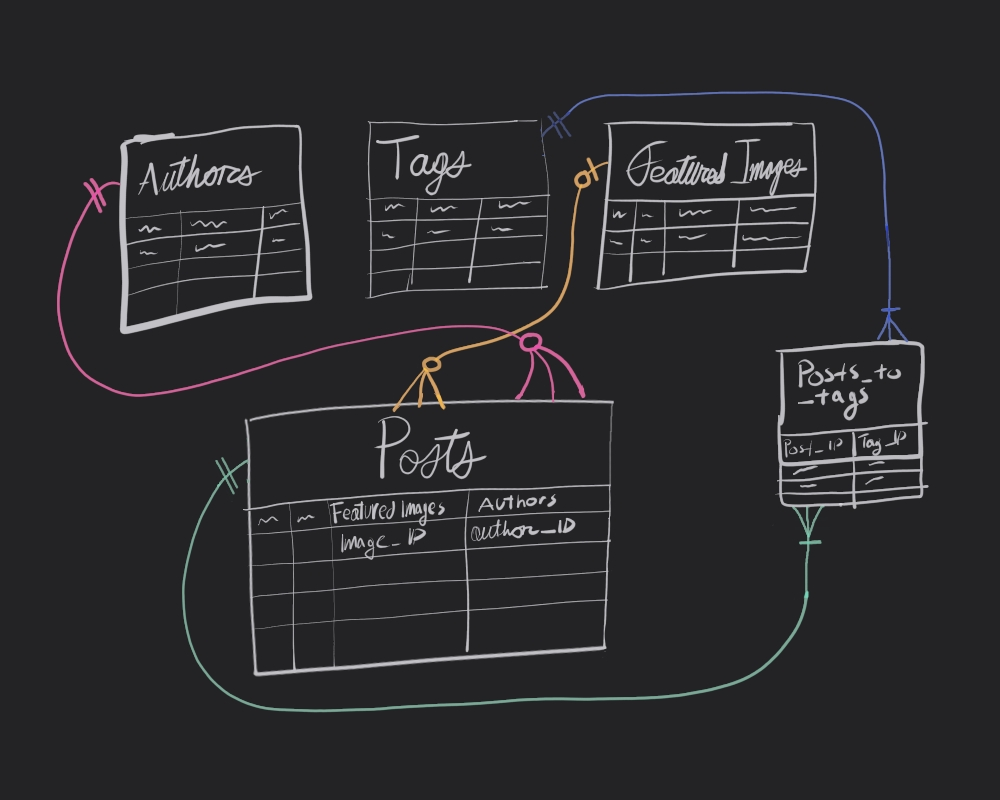

**This is Part 01 in a series of articles where I walkthrough how I built my own CMS**
*You can find the other parts of this series below (as they become available):*

- Part 01: How I Built a CMS, Using TypeScript, Bun, Drizzle, & Turso \(you're here\)
- Part 02: Scanning the Posts
- Part 03: Post Processing & Content Data Generation
- Part 04: Storing the Content Data
- Part 05: Retrieving the Content Data
- Part 06: Rendering the Data
- Part 07: Final Thoughts

This wasn't the series of posts I planned to write. Initially, I thought this series was going to be dedicated exclusively to my bespoke content management system. Where, I thought I’d wax poetic for a while about how *sometimes the best solutions, are tailor made.* However, I’ve since come back to my senses to realize that ***the best solution is the one with the smallest number of compromises***, sources be damned.

So, that’s where `contentlayer2`[^1] (maintained fork of `contentlayer`) came in to the equation. it's a library I stumbled upon that did exactly what I’d come up with, but in a better, more robust, and much more practical manner. In short, it's *beautiful*.

In honesty, I was awestruck by contentlayer’s pitch video[^2]. Especially so, because I’d just gone through the whole process of pouring blood, sweat, and tears into my own content management system for this site. It really wasn't long after that, that I swapped my whole custom solution out for it.

But, swallowed pride aside, creating my own content backend was quite a learning experience for me, so I wanted to talk about it. As such, I present to you *Part 01* of my technical summary on my custom solution.

### Contents

- [Introduction](#introduction)
- [Setup](#setup)
 	- [Drizzle + Turso](#drizzle--turso)
 	- [Schemas](#schemas)
 	- [Database Config](#database-config)
- [Overview of my CMS](#overview-of-my-cms)
 	- [Scanning](#scanning)
 	- [Processing](#processing)
 	- [Storing Data](#storing-data)
 	- [Fetching Data](#fetching-data)
 	- [Rendering Data](#rendering-data)
- [Up Next: Scanning the Posts](#up-next-scanning-the-posts)
- [Extra Thoughts](#extra-thoughts)

### Introduction

I started my life in web working with traditional CMSes like WordPress[^3] and then briefly, Ghost[^4]. Later, I took the JAMstack[^5] hype train as far as it could go, fetching data from headless CMSes[^6] like Strapi[^7] and Contentful[^8], and integrating it into Gatsby[^9] frontends. Then, sometime before building this site, I caught myself up on the latest headless CMSes people have been working with. I experimented with Payload CMS[^10] and Directus[^11], before diving into off-the-shelf backends like Supabase[^12], and PocketBase[^13] (my personal favorite).

However, something about all the options I weighed kept disappointing me in one way or another. So, after a day of feeling the frustration of yet another imperfect solution, I found myself one late evening going *"Yeah, well, I'll build my own CMS, with Blackjack, and Hookers! In fact, forget the CMS"*[^14]. So, that's what I did.

<iframe width="560" height="315" src="https://www.youtube-nocookie.com/embed/ubPWaDWcOLU?si=sAKW0ltueLH4SDW0" title="YouTube video player" frameborder="0" allow="accelerometer; autoplay; clipboard-write; encrypted-media; gyroscope; picture-in-picture; web-share" referrerpolicy="strict-origin-when-cross-origin" allowfullscreen></iframe>

My idea was pretty straightforward. Instead of a traditional user-friendly CMS, I based it on Astro's[^15] model of content management (Content Collections[^16]) —leveraging `markdown`[^17], `yaml`[^18], and `jsx`[^19] in `.mdx`[^20] files to store and organize content—with my own twist, a database I can cache all that data i want into. The latter meant I could fetch and generate content live in production, in taking advantage of Next.js’ SSR features[^21].

As such, the following was the strategy I'd come up with as I poured over documentation[^22] and the various Next.js markdown blog examples[^23][^24] Vercel[^25] has available:

1. Scan the posts.
2. Process the data.
3. Store data into a SQLite database
4. Fetch data from the database.
5. Render the data.

Sounds easy enough, right? Well, sorta. The largest hurdle to overcome was in the processing phase, when I decided simply fetching the featured Image `src`[^26] wasn’t good enough. That's because I wanted `srcset`[^27] blurs and that’s when things got complicated. A smaller hurdle, was realizing I wasn’t fetching the image transformations properly. Investigating why is how I wound up learning about Next’s `loaderFile`[^28] configuration option, but I digress as that’s somewhat specific to the fact I use a CDN[^29] (i.e., AWS CloudFront[^30]) to distribute this site (& it’s assets).

Now, while my custom solution worked, it was, admittedly, flawed. First, because I really only implemented the first three letters of the CRUD[^31] acronym for this. Second, by the time I came up with a way to auto delete content I’d removed, well, that's when I stumbled upon a rad little library called `contentlayer2`, as I'd mentioned before. That was the turning point which pretty much signaled the end of any further development on my custom solution.

Before that happened, I should mention why I wound up using Turso[^32], a SQLite[^33] (libSQL[^34]) DBaaS[^35] for this project, since SQLite's whole purpose is that it's embeddable.

Now, I actually did try that; embedding the SQLite database right into my Next.js application, and leveraging Bun’s native SQLite driver[^36] in the process. However, when I was testing development builds of this site on Vercel, I learned there were some limitations[^37][^38][^39].

The first issue was that, ephemeral storage in static functions makes SQLite impractical[^37]. Second, while a read-only implementation is possible[^38], you are limited by the serverless function's storage capacity[^39]. Finally, I couldn't get read-only SQLite to work on dynamically rendered routes. In my testing, reading from the embedded SQLite database was only possible on routes generated using `generateStaticParams`[^40].

So, in thinking about the future, and not wanting to limit my project pre-emptively, a DBaaS seemed my only viable option. However, by the time I'd actually realized that, I'd already written my Drizzle ORM[^41] statements for SQLite, and I wasn't in the mood for converting them into a different SQL format. So, of Drizzle's SQLite compatible drivers[^42], I wound up using Turso.

> I suppose I could’ve used Cloudflare’s D1[^43], instead of Turso, but the moose mascot was so gosh darn cute! Couple that with the fact they have a wonderfully generous free tier[^44], how could I say no?!

### Setup

Of the ORMs, I had narrowed it down to two options, Prisma[^45] or Drizzle ORM[^41]. I settled on Drizzle because I liked the focus on TypeScript, and I liked that you could write raw(ish) SQL as an escape hatch using its *magic SQL*[^46] operator. I also really liked the idea that the knowledge gained in working with it, would be transferable, since one of their taglines is *if you know SQL, you know Drizzle*. I'm also just a sucker for companies that know how to execute self-deprecating advertising strategies[^47][^48], so my heart was settled on using it.

#### Drizzle + Turso

Anyways, since I did end up using Drizzle, there was some configuration required before I could flesh out the rest of my solution. Aside from registering for Turso and generating my API keys, the first thing I had to do was setup a `drizzle.config.ts`[^49] file to use with Turso.

```typescript
// drizzle.config.ts
import type { Config } from 'drizzle-kit';
import { Resource } from 'sst';

dotenv.config();

export default {
  schema: './src/lib/db/schema/*',
  out: './drizzle/migrations',
  dialect: 'sqlite',
  driver: 'turso',
  dbCredentials: {
    url: Resource.TursoUrl.value,
    authToken: Resource.TursoAuth.value
  },
} satisfies Config;
```

I loosely followed Turso's guide on setting it up with Drizzle[^50], then came up with the resultant code above. In sum:

- I'm importing multiple schemas using the wildcard glob[^51] pattern (`*`).
- SQL migrations get written into the root `drizzle/` directory.
- I'm using the SQLite flavor of Drizzle, in tandem with the Turso driver.
- I load in my credentials for Turso using the `{ dbCredentials }` object.
- There's a type check which ensures that config object is in agreement with the `Config` type imported from `drizzle-kit`.

Something I should note, is that instead of injecting the Turso credentials from a `.env` file using something like `process.env.TURSO_AUTH`[^52], I took advantage of SST's[^53] *secret*[^54] component instead. You'll notice I tapped into the `{ Resource }`[^55] object from `sst` using some simple dot notation[^56]. This really just avoids the hassle of passing around a `.env.local`[^57] file between work machines / dev environments.

#### Schemas

Once I had that, then I just had to define some schemas/tables[^58] for my posts. This resulted in creating the following tables:

- authors
- tags
- featured_images
- posts

The idea was that the authors, featured_images, and tags tables would respectively create one-many[^59], and many-many[^59] relations to the posts table. Something like this:



In keeping with SQLites Datatypes[^60] and what's available in Drizzle[^61] Some commonalities between these tables (as we'll see), is that I'm using a `string` for each rows `id` and primary key column, and a `integer` set to `timestamp` for the date column. That's because the `id` is a `UUIDv4`[^62] generated using Bun's  `crypto.randomUUID()`[^63], and the date is a `utc` string. The `rawStr` column, is simply the raw `utf8` string generated from reading the `.mdx` file into memory.

Of note, in the below schemas, I'm manually exporting their types. Unfortunately, at the time, I simply wasn't aware of drizzle's `$inferInsert`[^64], `$inferSelect`[^64] functions to automatically generate types. So, that's why I'm doing it *artisanally*, in case you were wondering.

```typescript
// authors.ts

import { sqliteTable, text, integer } from 'drizzle-orm/sqlite-core';

export interface Authors {
  id: string;
  slug: string;
  date: Date;
  name: string;
  mastodon?: string;
  mastodonURL?: string;
  localKey: string;
  rawStr: string;
}

export const authors = sqliteTable('authors', {
  id: text('id').primaryKey(),
  slug: text('slug').unique().notNull(),
  date: integer('date', { mode: 'timestamp' }),
  name: text('name'),
  mastodon: text('mastodon'),
  mastodonURL: text('mastodon_url'),
  localKey: text('local_key'),
  rawStr: text('raw_str'),
});
```

```typescript
// tags.ts

import { sqliteTable, text, integer } from 'drizzle-orm/sqlite-core';

export interface Tags {
  id: string;
  slug: string;
  date: Date;
  title: string;
  localKey: string;
  rawStr?: string;
}

export const tags = sqliteTable('tags', {
  id: text('id').primaryKey(),
  slug: text('slug').unique(),
  date: integer('date', { mode: 'timestamp' }),
  title: text('title').unique(),
  localKey: text('local_key'),
  rawStr: text('raw_str'),
});
```

```typescript
//featured-images.ts

import { integer, sqliteTable, text } from 'drizzle-orm/sqlite-core';

export interface FeaturedImages {
  id: string;
  slug: string;
  date: Date;
  title?: string;
  fileLocation: string;
  caption?: string;
  credit?: string;
  creditUrlText?: string;
  creditUrl?: string;
  altText: string;
  localKey: string;
  blur: string;
  height: number;
  width: number;
  rawStr: string;
}

export const featuredImages = sqliteTable('featured_images', {
  id: text('id').primaryKey(),
  slug: text('slug').unique().notNull(),
  date: integer('date', { mode: 'timestamp' }),
  title: text('title'),
  fileLocation: text('file_location'),
  caption: text('caption'),
  credit: text('credit'),
  creditUrlText: text('credit_url_text'),
  creditUrl: text('credit_url'),
  localKey: text('local_key'),
  altText: text('alt_text'),
  blur: text('blur'),
  height: integer('height'),
  width: integer('width'),
  rawStr: text('raw_str'),
});
```

Since the `posts.ts` schema/table is the most complicated, being the one that integrates all the other tables, it's important to talk about what's happening. You'll notice in the below, I'm importing the previously defined schemas `authors`, `tags`, and `featured_images`, and consuming them both as foreign keys and in relational tables.

```typescript
// posts.ts

import { sqliteTable, text, primaryKey, integer } from 'drizzle-orm/sqlite-core';
import { relations } from 'drizzle-orm';
import { authors } from './authors';
import { tags } from './tags';
import { featuredImages } from './featured-images';

export const authorsRelations = relations(authors, ({ many }) => ({
  posts: many(posts),
}));

export const featuredImagesRelations = relations(featuredImages, ({ many }) => ({
  posts: many(posts),
}));

export interface Posts {
  id: string;
  slug: string;
  date: Date;
  tags: string[];
  author: string;
  headline: string;
  subheadline?: string;
  featuredImage: string;
  altCaption?: string;
  localKey: string;
  rawStr: string;
}

export const posts = sqliteTable('posts', {
  id: text('id').primaryKey(),
  authorId: text('author_id')
    .references(() => authors.id, { onUpdate: 'cascade', onDelete: 'cascade' })
    .notNull(),
  date: integer('date', { mode: 'timestamp' }),
  slug: text('slug').unique().notNull(),
  headline: text('headline').unique().notNull(),
  subheadline: text('subheadline'),
  featuredImageId: text('featured_image_id').references(() => featuredImages.id, {
    onUpdate: 'cascade',
    onDelete: 'cascade',
  }),
  altCaption: text('alt_caption'),
  localKey: text('local_key'),
  rawStr: text('raw_str'),
});

export const postsRelations = relations(posts, ({ one, many }) => ({
  author: one(authors, {
    fields: [posts.authorId],
    references: [authors.id],
  }),
  featuredImage: one(featuredImages, {
    fields: [posts.featuredImageId],
    references: [featuredImages.id],
  }),
  postToTags: many(postsToTags),
}));

export const postsToTags = sqliteTable(
  'posts_to_tags',
  {
    postId: text('post_id')
      .notNull()
      .references(() => posts.id, { onUpdate: 'cascade', onDelete: 'cascade' }),
    tagId: text('tag_id')
      .notNull()
      .references(() => tags.id, { onUpdate: 'cascade', onDelete: 'cascade' }),
  },
  (t) => {
    return {
      pk: primaryKey({ columns: [t.postId, t.tagId] }),
    };
  },
);

export const postsToTagsRelations = relations(postsToTags, ({ one }) => ({
  tag: one(tags, {
    fields: [postsToTags.tagId],
    references: [tags.id],
  }),
  post: one(posts, {
    fields: [postsToTags.postId],
    references: [posts.id],
  }),
}));
```

In using them as foreign keys, I'm really just taking advantage of the cascade operations.

As far as relations go, I'm using drizzles relations[^65] feature, and creating relational tables for both *one-to-many* (`authors`, `featured_images`) and *many-to-many* (`tags`) relations. In truth, this was somewhat *extra*, since I had foreign keys available to me on `turso`, but I was curious to know what `drizzle` was capable of, and this is one such addition that `drizzle` brings to the table (no pun intended >.\<), beyond (most) vanilla SQL functions.

#### Database Config

With all the schemas fleshed out the last thing to setup, was a connection to the remote DB on Turso[^66], where I then imported the schemas directly into the client connection.

```typescript
// turso-db.ts

import { drizzle } from 'drizzle-orm/libsql';
import { Resource } from 'sst';
import { createClient } from '@libsql/client';
import * as authors from './schema/authors';
import * as tags from './schema/tags';
import * as featuredImages from './schema/featured-images';
import * as posts from './schema/posts';

dotenv.config();

const client = createClient({
  url: Resource.TursoUrl.value,
  authToken: Resource.TursoAuth.value
});

export const maindb = drizzle(client, { schema: { ...authors, ...tags, ...featuredImages, ...posts } });
```

With that squared away, the final step was to push our schemas as tables to our database on `turso`, with a single command: `drizzle-kit push`[^67]. Though, since I was importing credentials via SST, that command was more like: `sst shell bun run drizzle-kit push`[^68], but I digress.

### Overview of my CMS

With the the database configured, the rest of the CMS could then be fleshed out. This process was in theory quite simple, following the outline from earlier. All I had to do was read content into memory, *process* them, and send it into the database via `insert` statements.

#### Scanning

In practice, this took the form of an extensive script I wrote that took advantage of Bun’s speedy File I/O APIs[^69], to scan a folder that held all the blog content, which then read any Markdown and MDX files into memory as UTF-8 strings, sans any ignored ones.

From there I used `gray-matter`[^70] to parse the stringified front matter, to then create an object to store both the front matter data and the raw string itself.

#### Processing

Then I checked that data for a UUID before generating a fresh UUIDv4 using `Bun.crypto` which gets injected into the original file’s front matter, where it can then be read back into memory to update the data object.

I also performed a similar step for the post slug as well, where I checked the front matter for the existence of a `slug` before generating one from the file name. I also checked if the slug and file name match, and if not, the file name overrides the slug. This is injected into the original file as well, and like the above, read back into memory to update the working data object.

Then I had a whole Image processing step, which, admittedly, is a little more complicated than the other two steps (as we’ll see). In short, a function scans the front matter data for an `imageSrc`, then it copies the (relatively defined) image from the `content/assets` folder, into Next’s `/public` folder[^14]. Then it runs the image through `plaiceholder`[^71] to generate a blurry placeholder image (in `base64`[^72] format) and to also fetch the image dimensions (height, width). Finally, it appends all that data to the object I’d generated earlier.

#### Storing Data

Then, with another script, I just pushed all the data to the SQLite database on Turso using `drizzle` statements to insert/update the database.

#### Fetching Data

Once all the data was loaded, I simply fetched it using `drizzle`’s query builder (mostly, some calls were proper `select` statements), and I took advantage of using the React `cache`[^73] hook built into Next.js to memoize those DB calls.

> There wasn’t a real point to doing so, seeing as I never implemented ISR, so the post page data never really went stale. Still, I figured in the event I did implement it, it’d come in handy. Well, at least I know how it works now.

#### Rendering Data

Once I had the data, the only thing left to do was to use `mdx-bundler`[^74] to process the raw MDX string, and I just loaded everything else into my front end.

### Up Next: Scanning the Posts

Alright, that's it for today's blog post, since the following steps get fairly extensive. The very next post of this series will focus on how the posts were *scanned* or read into memory, and the post after that will get into the processing phase of events.

### Extra Thoughts

Originally I was planning on writing out this whole project as one long article, but considering how messy my previous article has gotten since I've *corrected* it, I think breaking things into manageable chunks is probably the way to go. I mean, it works for computers after all, doesn't it?

As well, I've decided on using a standard method of citations going forward. It's something I'm used to, even though my last article used hyperlinks, rather than actual citations. That was mostly because I dragged my feet on configuring zotero[^75]. But, since I did manage to refamiliarize myself with the little citation manager for this article, please enjoy the extensive bibliography I've generated below.

[^1]: Timothy. timlrx/contentlayer2 [Internet]. 2024 [cited 2024 Sep 13]. Available from: [https://github.com/timlrx/contentlayer2](https://github.com/timlrx/contentlayer2)

[^2]: Contentlayer Makes Working with Content Easy for Developers [Internet]. 2022 [cited 2024 Sep 13]. Available from: [https://www.youtube.com/watch?v=58Pj4a4Us7A](https://www.youtube.com/watch?v=58Pj4a4Us7A)

[^3]: Blog Tool, Publishing Platform, and CMS [Internet]. WordPress.org. 2024 [cited 2024 Oct 6]. Available from: [https://wordpress.org/](https://wordpress.org/)

[^4]: Ghost: The best open source blog & newsletter platform [Internet]. Ghost - The Professional Publishing Platform. [cited 2024 Oct 6]. Available from: [https://ghost.org/](https://ghost.org/)

[^5]: What is JAMstack? [Internet]. [cited 2024 Oct 6]. Available from: [https://www.cloudflare.com/learning/performance/what-is-jamstack/](https://www.cloudflare.com/learning/performance/what-is-jamstack/)

[^6]: Headless CMS: Everything you need to know [Internet]. [cited 2024 Oct 6]. Available from: [https://hygraph.com/learn/headless-cms](https://hygraph.com/learn/headless-cms)

[^7]: Strapi - Open source Node.js Headless CMS 🚀 [Internet]. [cited 2024 Oct 6]. Available from: [https://strapi.io/](https://strapi.io/)

[^8]: Content that takes you everywhere [Internet]. [cited 2024 Oct 6]. Available from: [https://www.contentful.com/](https://www.contentful.com/)

[^9]: The Best React-Based Framework [Internet]. Gatsby. [cited 2024 Oct 6]. Available from: [https://www.gatsbyjs.com/](https://www.gatsbyjs.com/)

[^10]: Payload: The fastest growing open-source headless CMS [Internet]. Payload. [cited 2024 Oct 6]. Available from: [https://payloadcms.com](https://payloadcms.com)

[^11]: The Open Source Headless CMS (and More) [Internet]. [cited 2024 Oct 6]. Available from: [https://directus.io/](https://directus.io/)

[^12]: Supabase | The Open Source Firebase Alternative [Internet]. Supabase. [cited 2024 Oct 6]. Available from: [https://supabase.com/](https://supabase.com/)

[^13]: PocketBase - Open Source backend in 1 file [Internet]. [cited 2024 Oct 6]. Available from: [https://pocketbase.io/](https://pocketbase.io/)

[^14]: Futurama - Build my own themepark, with blackjack, and hookers [Internet]. 2020 [cited 2024 Oct 6]. Available from: [https://www.youtube.com/watch?v=ubPWaDWcOLU](https://www.youtube.com/watch?v=ubPWaDWcOLU)

[^15]: Astro [Internet]. Astro. [cited 2024 Oct 6]. Available from: [https://astro.build/](https://astro.build/)

[^16]: Content Collections [Internet]. Docs. [cited 2024 Oct 6]. Available from: [https://docs.astro.build/en/guides/content-collections/](https://docs.astro.build/en/guides/content-collections/)

[^17]: Daring Fireball: Markdown [Internet]. [cited 2024 Oct 6]. Available from: [https://daringfireball.net/projects/markdown/](https://daringfireball.net/projects/markdown/)

[^18]: The Official YAML Web Site [Internet]. [cited 2024 Oct 6]. Available from: [https://yaml.org/](https://yaml.org/)

[^19]: Writing Markup with JSX – React [Internet]. [cited 2024 Oct 6]. Available from: [https://react.dev/learn/writing-markup-with-jsx](https://react.dev/learn/writing-markup-with-jsx)

[^20]: Wormer JO and T. Markdown for the component era [Internet]. MDX. 2017 [cited 2024 Oct 6]. Available from: [https://mdxjs.com/](https://mdxjs.com/)

[^21]: Rendering: Server Components | Next.js [Internet]. [cited 2024 Oct 6]. Available from: [https://nextjs.org/docs/app/building-your-application/rendering/server-components](https://nextjs.org/docs/app/building-your-application/rendering/server-components)

[^22]: Configuring: MDX | Next.js [Internet]. [cited 2024 Oct 6]. Available from: [https://nextjs.org/docs/app/building-your-application/configuring/mdx](https://nextjs.org/docs/app/building-your-application/configuring/mdx)

[^23]: next.js/examples/blog-starter at canary · vercel/next.js [Internet]. GitHub. [cited 2024 Oct 6]. Available from: [https://github.com/vercel/next.js/tree/canary/examples/blog-starter](https://github.com/vercel/next.js/tree/canary/examples/blog-starter)

[^24]: examples/solutions/blog at main · vercel/examples [Internet]. GitHub. [cited 2024 Oct 6]. Available from: [https://github.com/vercel/examples/tree/main/solutions/blog](https://github.com/vercel/examples/tree/main/solutions/blog)

[^25]: Vercel: Build and deploy the best web experiences with the Frontend Cloud [Internet]. Vercel. [cited 2024 Oct 6]. Available from: [https://vercel.com/home](https://vercel.com/home)

[^26]: HTMLImageElement: src property - Web APIs | MDN [Internet]. 2023 [cited 2024 Oct 6]. Available from: [https://developer.mozilla.org/en-US/docs/Web/API/HTMLImageElement/src](https://developer.mozilla.org/en-US/docs/Web/API/HTMLImageElement/src)

[^27]: HTMLImageElement: srcset property - Web APIs | MDN [Internet]. 2024 [cited 2024 Oct 6]. Available from: [https://developer.mozilla.org/en-US/docs/Web/API/HTMLImageElement/srcset](https://developer.mozilla.org/en-US/docs/Web/API/HTMLImageElement/srcset)

[^28]: Components: \<Image\> | Next.js [Internet]. 2024 [cited 2024 Sep 13]. Available from: [https://nextjs.org/docs/app/api-reference/components/image#loaderfile](https://nextjs.org/docs/app/api-reference/components/image#loaderfile)

[^29]: What is a content delivery network (CDN)? | How do CDNs work? [Internet]. [cited 2024 Oct 6]. Available from: [https://www.cloudflare.com/learning/cdn/what-is-a-cdn/](https://www.cloudflare.com/learning/cdn/what-is-a-cdn/)

[^30]: Content Delivery Network - Amazon CloudFront - AWS [Internet]. Amazon Web Services, Inc. [cited 2024 Oct 6]. Available from: [https://aws.amazon.com/cloudfront/](https://aws.amazon.com/cloudfront/)

[^31]: What is CRUD? [Internet]. Codecademy. [cited 2024 Oct 6]. Available from: [https://www.codecademy.com/article/what-is-crud](https://www.codecademy.com/article/what-is-crud)

[^32]: Turso — SQLite for Production [Internet]. Turso. 2024 [cited 2024 Sep 13]. Available from: [https://turso.tech](https://turso.tech)

[^33]: About SQLite [Internet]. [cited 2024 Oct 6]. Available from: [https://www.sqlite.org/about.html](https://www.sqlite.org/about.html)
[^34]: tursodatabase/libsql [Internet]. Turso Database; 2024 [cited 2024 Oct 6]. Available from: [https://github.com/tursodatabase/libsql](https://github.com/tursodatabase/libsql)

[^35]: What Is Database as a Service (DBaaS)? | IBM [Internet]. 2021 [cited 2024 Oct 6]. Available from: [https://www.ibm.com/topics/dbaas](https://www.ibm.com/topics/dbaas)

[^36]: SQLite – API | Bun Docs [Internet]. Bun. [cited 2024 Oct 6]. Available from: [https://bun.sh/docs/api/sqlite](https://bun.sh/docs/api/sqlite)

[^37]: Rumzan I. Is SQLite supported in Vercel? [Internet]. [cited 2024 Oct 6]. Available from: [https://vercel.com/guides/is-sqlite-supported-in-vercel](https://vercel.com/guides/is-sqlite-supported-in-vercel)

[^38]: Read-only sqlite · vercel · Discussion #1181 [Internet]. GitHub. [cited 2024 Oct 6]. Available from: [https://github.com/orgs/vercel/discussions/1181](https://github.com/orgs/vercel/discussions/1181)

[^39]: Vercel Functions Limitations [Internet]. [cited 2024 Oct 6]. Available from: [https://vercel.com/docs/functions/limitations](https://vercel.com/docs/functions/limitations)

[^40]: Functions: generateStaticParams | Next.js [Internet]. [cited 2024 Oct 6]. Available from: [https://nextjs.org/docs/app/api-reference/functions/generate-static-params](https://nextjs.org/docs/app/api-reference/functions/generate-static-params)

[^41]: Drizzle ORM - next gen TypeScript ORM. [Internet]. 2024 [cited 2024 Sep 13]. Available from: [https://orm.drizzle.team/](https://orm.drizzle.team/)

[^42]: Drizzle ORM - SQLite [Internet]. [cited 2024 Oct 6]. Available from: [https://orm.drizzle.team/docs/get-started-sqlite](https://orm.drizzle.team/docs/get-started-sqlite)

[^43]: Overview | Cloudflare D1 docs [Internet]. Cloudflare Docs. [cited 2024 Oct 6]. Available from: [https://developers.cloudflare.com/d1/](https://developers.cloudflare.com/d1/)

[^44]: Turso Database Pricing [Internet]. [cited 2024 Oct 6]. Available from: [https://turso.tech/pricing](https://turso.tech/pricing)

[^45]: Prisma | Simplify working and interacting with databases [Internet]. Prisma. [cited 2024 Oct 6]. Available from: [https://www.prisma.io](https://www.prisma.io)

[^46]: Drizzle ORM - Magic sql operator [Internet]. [cited 2024 Oct 6]. Available from: [https://orm.drizzle.team/docs/sql](https://orm.drizzle.team/docs/sql)

[^47]: Kale V, Sayin E. Impressive insults: How do consumers respond to self‐deprecating advertisements? Psychology & Marketing. 2024 Jul 20;41:2695–2710.

[^48]: Liu C, Gao J. What makes a self-deprecating advertisement more persuasive? The role of self-uncertainty. Asia Pacific Journal of Marketing and Logistics. 2023 Jul 11;36.

[^49]: Drizzle ORM - Config Reference [Internet]. [cited 2024 Oct 6]. Available from: [https://orm.drizzle.team/kit-docs/config-reference](https://orm.drizzle.team/kit-docs/config-reference)

[^50]: Drizzle + Turso [Internet]. Turso. [cited 2024 Oct 6]. Available from: [https://docs.turso.tech/sdk/ts/orm/drizzle](https://docs.turso.tech/sdk/ts/orm/drizzle)

[^51]: Glob Tool | DigitalOcean [Internet]. [cited 2024 Oct 6]. Available from: [https://www.digitalocean.com/community/tools/glob](https://www.digitalocean.com/community/tools/glob)

[^52]: Node.js — How to read environment variables from Node.js [Internet]. [cited 2024 Oct 6]. Available from: [https://nodejs.org/en/learn/command-line/how-to-read-environment-variables-from-nodejs](https://nodejs.org/en/learn/command-line/how-to-read-environment-variables-from-nodejs)

[^53]: What is SST [Internet]. SST. 2024 [cited 2024 Oct 6]. Available from: [https://sst.dev/docs/](https://sst.dev/docs/)

[^54]: Secret [Internet]. SST. [cited 2024 Oct 6]. Available from: [https://sst.dev/docs/component/secret/](https://sst.dev/docs/component/secret/)

[^55]: Linking [Internet]. SST. 2024 [cited 2024 Oct 6]. Available from: [https://sst.dev/docs/linking/](https://sst.dev/docs/linking/)
[^56]: Property accessors - JavaScript | MDN [Internet]. 2024 [cited 2024 Oct 6]. Available from: [https://developer.mozilla.org/en-US/docs/Web/JavaScript/Reference/Operators/Property_accessors](https://developer.mozilla.org/en-US/docs/Web/JavaScript/Reference/Operators/Property_accessors)

[^57]: Configuring: Environment Variables | Next.js [Internet]. [cited 2024 Oct 6]. Available from: [https://nextjs.org/docs/app/building-your-application/configuring/environment-variables](https://nextjs.org/docs/app/building-your-application/configuring/environment-variables)

[^58]: Drizzle ORM - Schema [Internet]. [cited 2024 Oct 7]. Available from: [https://orm.drizzle.team/docs/sql-schema-declaration](https://orm.drizzle.team/docs/sql-schema-declaration)

[^59]: Three Table Types Relationship (1:1, 1:n, m:n) [Internet]. [cited 2024 Oct 7]. Available from: [https://www.relationaldbdesign.com/database-design/module6/three-relationship-types.php](https://www.relationaldbdesign.com/database-design/module6/three-relationship-types.php)

[^60]: Datatypes In SQLite [Internet]. [cited 2024 Oct 7]. Available from: [https://www.sqlite.org/datatype3.html](https://www.sqlite.org/datatype3.html)

[^61]: Drizzle ORM - SQLite column types [Internet]. [cited 2024 Oct 7]. Available from: [https://orm.drizzle.team/docs/column-types/sqlite](https://orm.drizzle.team/docs/column-types/sqlite)

[^62]: Davis KR, Peabody B, Leach P. Universally Unique IDentifiers (UUIDs) [Internet]. Internet Engineering Task Force; 2024 May. Report No.: RFC 9562. Available from: [https://datatracker.ietf.org/doc/rfc9562](https://datatracker.ietf.org/doc/rfc9562)

[^63]: Crypto: randomUUID() method - Web APIs | MDN [Internet]. 2024 [cited 2024 Oct 7]. Available from: [https://developer.mozilla.org/en-US/docs/Web/API/Crypto/randomUUID](https://developer.mozilla.org/en-US/docs/Web/API/Crypto/randomUUID)

[^64]: Drizzle ORM - Goodies [Internet]. [cited 2024 Oct 7]. Available from: [https://orm.drizzle.team/docs/goodies](https://orm.drizzle.team/docs/goodies)

[^65]: Drizzle ORM - Query [Internet]. [cited 2024 Oct 7]. Available from: [https://orm.drizzle.team/docs/rqb#declaring-relations](https://orm.drizzle.team/docs/rqb#declaring-relations)

[^66]: Drizzle ORM - Turso [Internet]. [cited 2024 Oct 7]. Available from: [https://orm.drizzle.team/docs/connect-turso](https://orm.drizzle.team/docs/connect-turso)

[^67]: Drizzle ORM - `push` [Internet]. [cited 2024 Oct 7]. Available from: [https://orm.drizzle.team/docs/drizzle-kit-push](https://orm.drizzle.team/docs/drizzle-kit-push)

[^68]: CLI [Internet]. SST. [cited 2024 Oct 7]. Available from: [https://sst.dev/docs/reference/cli/](https://sst.dev/docs/reference/cli/)

[^69]: File I/O – API | Bun Docs [Internet]. Bun. 2024 [cited 2024 Sep 13]. Available from: [https://bun.sh/docs/api/file-io](https://bun.sh/docs/api/file-io)

[^70]: Schlinkert J. jonschlinkert/gray-matter [Internet]. 2024 [cited 2024 Sep 13]. Available from: [https://github.com/jonschlinkert/gray-matter](https://github.com/jonschlinkert/gray-matter)

[^71]: Plaiceholder [Internet]. 2023 [cited 2024 Sep 13]. Available from: [https://plaiceholder.co/docs](https://plaiceholder.co/docs)
[^72]: Base64 - MDN Web Docs Glossary: Definitions of Web-related terms | MDN [Internet]. 2024 [cited 2024 Oct 7]. Available from: [https://developer.mozilla.org/en-US/docs/Glossary/Base64](https://developer.mozilla.org/en-US/docs/Glossary/Base64)

[^73]: Building Your Application: Caching | Next.js [Internet]. [cited 2024 Oct 7]. Available from: [https://nextjs.org/docs/app/building-your-application/caching](https://nextjs.org/docs/app/building-your-application/caching)

[^74]: Dodds KC. mdx-bundler: Compile and bundle your MDX files and their dependencies. FAST. [Internet]. 2021 [cited 2024 Sep 13]. Available from: [https://github.com/kentcdodds/mdx-bundler](https://github.com/kentcdodds/mdx-bundler)

[^75]: Zotero | Your personal research assistant [Internet]. [cited 2024 Oct 7]. Available from: [https://www.zotero.org/](https://www.zotero.org/)
