import BlueskyEmbed from '../../../../src/components/embeds/bluesky/index.tsx';

Since I finally managed to break the CI/CD pipeline for this site, I've been thinking a lot about that infamous quote from the Senator for Alaska. Not for its accuracy (or lack thereof), but because in this one instance, I did, in fact, break (or jam) a _critical tube_ that gets this site out to the internet. Though, I should admit that's not what took this site offline for 4 hours (we'll get to that part soon).

## The Situation

At around 0600 Zulu time on February 21st, I rebased this site's production branch with main, and pushed two of my latest commits. One updated my `flake.nix` inputs (updated `flake.lock`), the other was a simple fix to the cards on the landing page. About 30 minutes later I received the following email.


What followed was what I can only describe as _an adventure_.

<BlueskyEmbed postUrl='https://bsky.app/profile/laniakita.com/post/3lio7a7quw227' />

That _skeet_ now serves as both a historical record of what happened that Thursday night, and was the inspiration behind this very blog post.

## A Preliminary Investigation

Debugging is an _Art_. While I'm not the world's greatest detective, I am pretty good at sniffing out the cause of the issue, and assembling a solution thereafter. So, let's go through what I did.

### POI #01: Timing Out & Freezing

The first thing I did was look into the [workflow logs](https://github.com/laniakita/website/actions/runs/13448074321/job/37577491756), where I discovered our first Point of Interest (POI), the timeout error.


Given my experience with the beta version of SSTv3 (`Ion`), an occasional timeout on `sst deploy` wasn't entirely unexpected. It's why I set `timeout-minutes: 30` on the _Deploy_ step in the first place. So, I decided to give it another go.

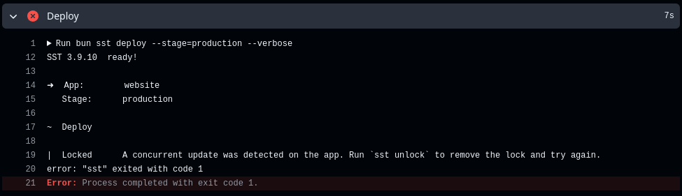

This gave a _Locked state error_, since the previous deploy attempt didn't get to _gracefully_ cancel deployment to AWS. So, following the error message's guidance, I ran `sst unlock` from my terminal and tried again.

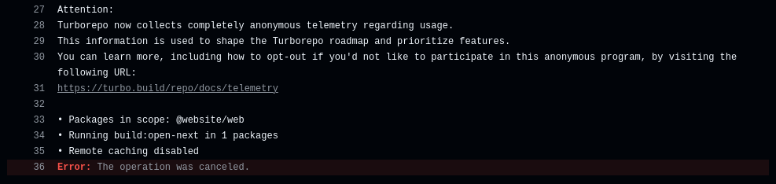

_Huh._ I was audibly stunned. Watching this attempt go by, I was confounded why it was stuck at the same place as the first attempt. At about a minute and 23 seconds in, I pulled the plug.

While that might seem pre-emptive, compared to a _successful_ production run up to this point, the process would be about half way done by now, so freezing up at line 39 was incredibly odd.

### Troubleshooter's Step 01: Unplug it and Plug it Back in

I was feeling puzzled, until I was suddenly struck with _genius_. I would simply perform the equivalent of _unplugging and plugging it back in again_ via running `sst remove` and `sst deploy`, _magically_ solving my problems! **_What could go wrong?_**

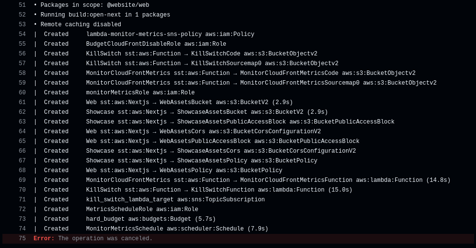

While I was grateful that _attempt 04_ displayed some signs of life, at about 4 minutes into the Deploy however, it was clear something had _gone wrong_. So, I pulled the plug on this attempt too.

To make matters worse, because I did run `sst remove --stage=production`, my **production** site was now ripped from the internet. While this would be fine if I had either a backup to divert traffic to, or realized I could've just re-run the last passing production Build Action, I unfortunately did not. This was cause for some _light_ panic.

<details open>

<summary>Hubris: All in on Production</summary>

If you notice the [repo](https://github.com/laniakita/website) for this site today, there's now two workflows I use: one for _dev_ and one for _production_. However, it wasn't like that before this happened.

Why? Well, one part of it was stinginess, another was avoiding the work to add a dev build banner into the nav when the URL !== productionUrl. The rest of it though? That was arrogance. My hubris.

However, that's not to say I didn't have a _dev_ deployment stage. I setup a _dev_ AWS account specifically to live test _radical_ changes of this site, before I rebased them into production.

At the time, I figured that was good-enough, and a dev CI/CD would be something _nice to have_. I suppose I didn't feel strongly enough then to follow through with a proper CI/CD to handle _main_ for this little blog/portfolio thing. That was a foolish error on my part.

</details>

### Troubleshooter's Step 02: Update Deps

As I was reeling from terror, I decided to try an emergency dependencies update of Node.js and Turbo. I didn't have any evidence that they we're the cause of the problems, but a cheap hail-mary attempt seemed worth a shot.

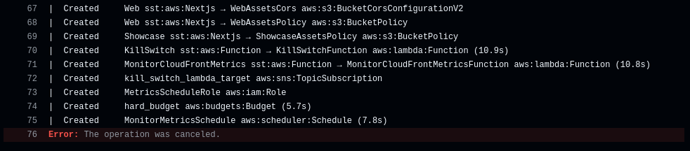

_No dice._ As a follow-up, I wondered if re-creating `bun.lock` might help, so I tried that too.

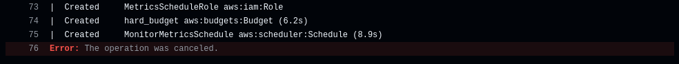

As you can imagine, that didn't work either.

### Troubleshooter's step 03: Pin Deps

If updating dependencies wasn't working, perhaps pinning them to an older version might help. I decided `sst` might be playing a role here, so I rolled it back, and ran the CI again.

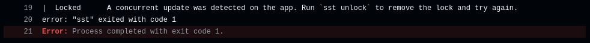

_Oops_. I correct the _Lock_ once more, and sent through my final _hail mary_ attempt for the evening.

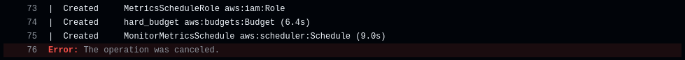

_Sigh_. I let out a pained sigh. _This is gonna require **thinking**, isn't it?_, I whined to myself. So, I took a break for a couple of hours, and contemplated.

## Approaching a Solution

After my basic troubleshooting session brought me to somewhere worse than square one (no website), I started mulling over what I learned.

What I found peculiar, was that consecutive runs would hang around the same place. For whatever reason, attempting to build `@website/web` (this site), would lockup the Deploy step either right away (if the other functions don't exist yet), or 75 lines in if my metrics monitoring functions need to be created. Either way, this pointed to something going wrong with _how_ `@website/web` was being built.

### New POIs

This realization, narrowed things down to a few potential causes:

- `@website/web` is being built, but something is failing to report that step finished (`sigterm`), freezing the Deploy step as a result.
- `@website/web` is failing to build in the CI runner for _reasons_.
  - Perhaps the `sst` CLI has a bug in reading the flag syntax?
  - Perhaps Ubuntu/Debian is being difficult with SST again (I think this was an issue during the beta).
- The Turborepo tasks for `@website/web` aren't being executed properly.
  - A task that occurs before `build`, like `test`, might be _failing_ to send a `sigterm`, or `bun`/`sst`/`turbo` is failing to pick it up.
  - In any event, the `build` task for `@website/web` gets stuck waiting to be executed, causing the hang.

So, I decided to go down this list from _ez_ to _difficult_ in trying to solve the problem.

### Too EZ: Check your syntax

While I can't find the relevant issue now, I do remember coming across a closed issue in the [sst](https://github.com/sst/sst) repo, detailing that running a command like `sst COMMAND --FLAG=VAR` was causing issues but `sst COMMAND --FLAG VAR` wasn't. I believe I tried to run this locally, but that didn't fix it, so I moved on.

### Redefining Turborepo's Tasks

Armed with the possibility the _tasks_ we'ren't executing properly, I decided to remove the `prebuild` task as dependency of `test` from the `turbo.json` in both `@website/web` and `@website/showcase`. I also made `build` depend on other build tasks first (suggested by the [turborepo docs](https://turbo.build/repo/docs/crafting-your-repository/configuring-tasks#running-tasks-in-the-right-order))

```diff
    "test": {
-      "dependsOn": ["prebuild"]
+      "dependsOn": []
    },
    "build": {
-      "dependsOn": ["test"],
+      "dependsOn": ["test", "^build"],
```

I also changed the `buildCommand` (for both `web` and `showcase`) in my `sst.aws.Nextjs` function to specify bun specifically.

```diff

export const web = new sst.aws.Nextjs("Web", {
  path: "apps/web",
-  buildCommand: "turbo build:open-next",
+  buildCommand: "bun run turbo build:open-next;",
  server: {
    runtime: "nodejs22.x"
  },

```

Then (locally) I held my breath and ran `sst deploy --stage production --verbose`. _Thank fuck!_ I was overwhelmed with relief, when I saw things had gone smoothly, and everything was back online.

For a bit I even contemplated calling it here, but I knew that deploying locally and deploying in the CI were two very different things. However, having tasted this victory, I was confident I could coax a second from the CI runner.

So, with a foolish grin, I pulled the website down with `sst remove`, because I knew an even greater victory awaited me in the CI runner.

## Overcoming the CI runner

Since everything worked locally, I figured either it would _just work_ in the CI runner, or if it didn't, I could just further reduce the barriers to the build step like I did earlier. So, I rebased _main_ onto _production_ and pushed things through.

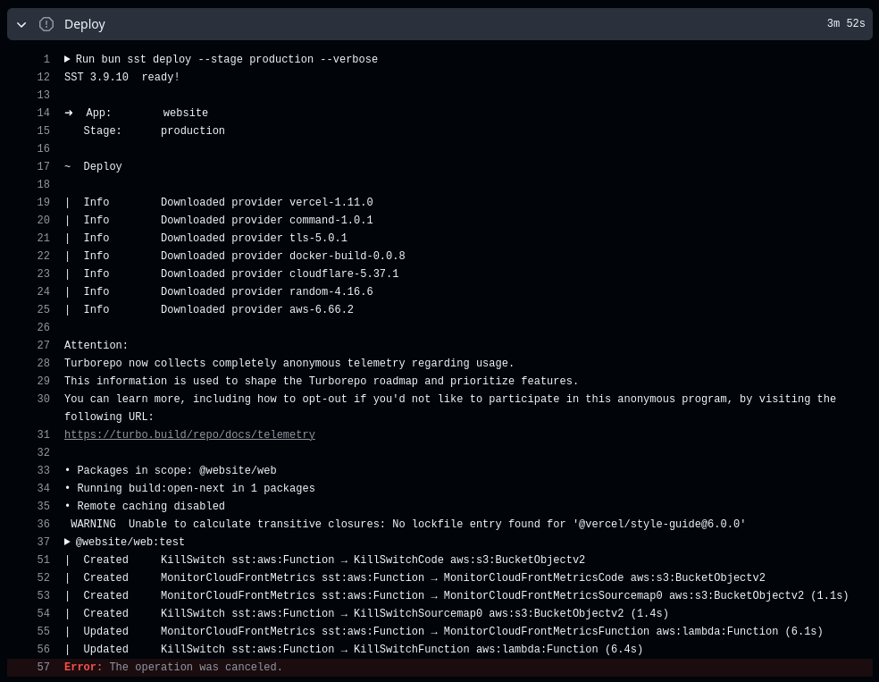

Unsurprisingly, things did not _just work_. However, I did have an inkling of what I was doing this time around, so I got to work.

### Experiment 01: Isolating the Tasks

From earlier, I altered the build commands back to what they were, in case that was causing a problem.

```diff

export const web = new sst.aws.Nextjs("Web", {
  path: "apps/web",
-  buildCommand: "bun run turbo build:open-next;",
+  buildCommand: "turbo build:open-next",
  server: {
    runtime: "nodejs22.x"
  },

```

Then I altered the tasks array somewhat back to what it was (which failed locally, but this is science now). I set `prebuild` to depend on nothing, and made `test` depend on `prebuild` (as it was).

```diff
  "extends": ["//"],
  "tasks": {
    "prebuild": {
+      "dependsOn": [],
      "inputs": ["$TURBO_DEFAULT$", "content/**"],
      "outputs": [".contentlayer", ".contentlayermini", ".versionvault"]
    },
    "test": {
-      "dependsOn": []
+      "dependsOn": ["prebuild"]
    },
    "build": {
      "dependsOn": ["test", "^build"],
```

This gave an interesting result.

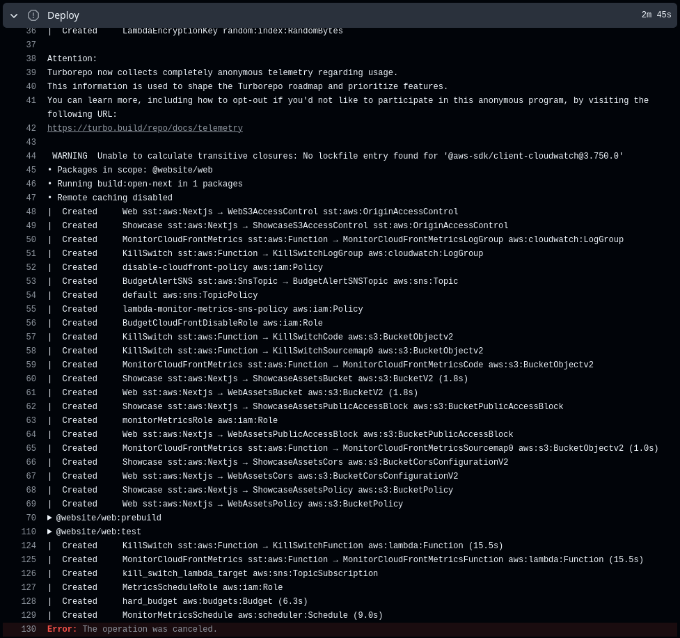

While I wasn't _enthusiastic_ about what I saw, it was an interesting result. In hindsight, this might've worked, I think I just got nervous around the two-minute mark and assumed the worse. Still, I pressed on.

### Experiment 02: Simplifying the Task Dependencies

I decided to do two things. I continued to tweak the build command, and then I did what I believed was the solution (simplifying the task deps) to start at the build task immediately.

```diff
export const web = new sst.aws.Nextjs("Web", {
  path: "apps/web",
-  buildCommand: "turbo build:open-next",
+  buildCommand: "turbo build:open-next;",
  server: {
    runtime: "nodejs22.x"
  }
```

```diff
    "test": {
-      "dependsOn": ["prebuild"]
+      "dependsOn": []
    },
    "build": {
-      "dependsOn": ["test", "^build"],
+      "dependsOn": ["^build"],
      "outputs": [".next/**", "public/dist/**", "public/sw.js"],
      "inputs": [
        "$TURBO_DEFAULT$",
```

This gave me the result I was working so hard towards.

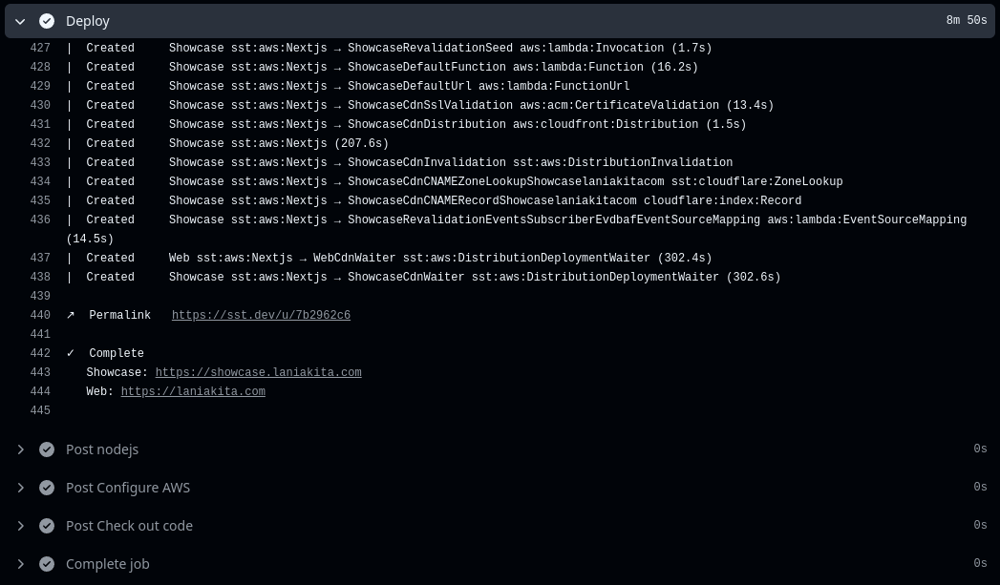

_I did it! I did the thing!_ I was ecstatic for the rest of the evening, basking in victory. It's just unfortunate this did not last into the next day when I setup the _dev_ workflow. My attempt at integrating the lesson I had just learned.

## Revenge of the CI Runner

In setting up the _dev_ Action Workflow, I hit a painfully familiar snag (after hitting a few unrelated snags).

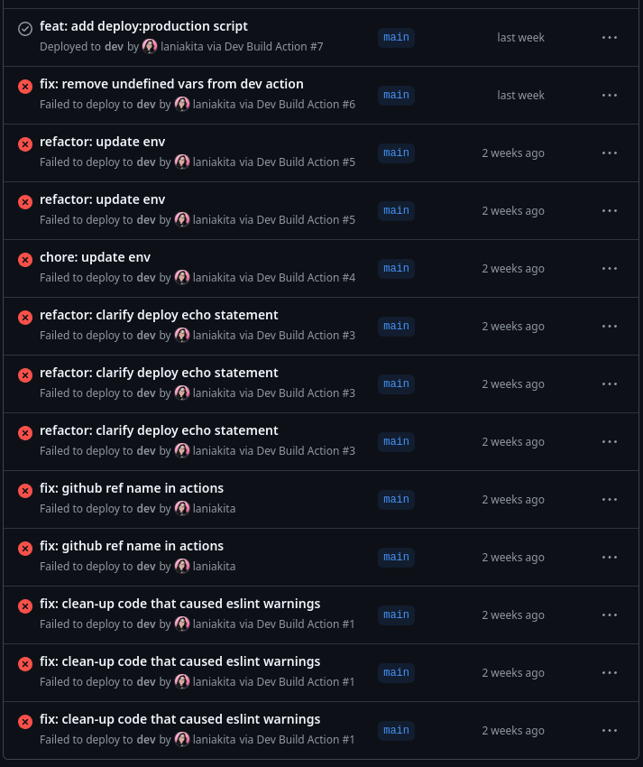

> Why yes, I am writing about this 2 weeks later, thank you for noticing \>.\<


<details>

<summary>[INFO]: Workflow for build #41</summary>

```yml
name: Production Build Action
run-name: ${{github.actor}} is building for production
on:
  push:
    branches:
      - production
permissions:
  id-token: write
  contents: read
env:
  CLOUDFLARE_DEFAULT_ACCOUNT_ID: ${{ secrets.CLOUDFLARE_DEFAULT_ACCOUNT_ID }}
  CLOUDFLARE_API_TOKEN: ${{ secrets.CLOUDFLARE_API_TOKEN }}
jobs:
  SST-Deploy-Production:
    if: ${{ github.ref == 'refs/heads/production' }}
    environment: production
    runs-on: ubuntu-latest
    steps:
      # info
      - run: echo "Deploying to production on branch $GITHUB_REF"
      - run: echo "Build triggered by ${{ github.event_name }}"
      - run: echo "Building on ${{ runner.os }}"

      # fetch repo
      - name: Check out code
        uses: actions/checkout@v2
      - run: echo "Checked out ${{ github.repository }}"

      # aws
      - name: Configure AWS
        uses: aws-actions/configure-aws-credentials@v4
        with:
          role-to-assume: ${{ secrets.AWS_ROLE_TO_ASSUME }}
          aws-region: ${{ secrets.AWS_REGION }}
          mask-aws-account-id: true

      - name: Add AWS profile to ~/.aws/credentials
        run: |
          aws configure set region ${{ secrets.AWS_REGION }} --profile lani-production
          aws configure set aws_access_key_id ${{ env.AWS_ACCESS_KEY_ID }} --profile lani-production
          aws configure set aws_secret_access_key ${{ env.AWS_SECRET_ACCESS_KEY }} --profile lani-production
          aws configure set aws_session_token ${{ env.AWS_SESSION_TOKEN }} --profile lani-production
      # nodejs
      - name: nodejs
        uses: actions/setup-node@v4
        with:
          node-version: '22.11.0'

      # install bun
      - run: npm install --global bun

      # install packages
      - name: install packages
        run: bun install

      # ROTFB
      - name: Deploy
        run: bun sst deploy --stage=production --verbose
        timeout-minutes: 30
```

</details>

## To Be continued ...

This section still needs work.
